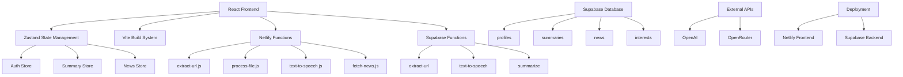

# TLDRit - AI-Powered Content Summarization Platform

**TLDRit** is a modern Progressive Web App (PWA) that transforms how you consume content by providing AI-powered summaries of articles, documents, and web content. With personalized news feeds, text-to-speech capabilities, and intelligent summarization, TLDRit makes information consumption faster and more efficient.

---

## 🚀 Current Features

### ✅ Completed Features

- 🔐 **User Authentication** - Complete Supabase auth with email/password
- ✂️ **Multi-Input Summarization** - Text, URL, and file (PDF, DOCX, TXT) processing
- 🎚️ **Customizable Summary Levels** - 4 levels from brief to comprehensive
- 🧒 **ELI5 Mode** - Age-appropriate explanations (5, 10, 15 years)
- 📰 **Personalized News Feed** - Interest-based content curation
- 🔊 **Text-to-Speech** - Audio generation for summaries
- 💾 **Summary History** - Save and retrieve past summaries
- 📱 **PWA Support** - Installable mobile app experience
- 🌙 **Dark Mode** - Full dark/light theme support
- 🔒 **Premium Features** - Freemium model with usage limits

### 🎯 Architecture Overview



---

## 🧱 Tech Stack

### Frontend
- **React 18** with TypeScript
- **Vite** for build tooling and development
- **Tailwind CSS** for styling
- **React Router** for navigation
- **Zustand** for state management
- **Lucide React** for icons

### Backend & Database
- **Supabase** (PostgreSQL, Auth, Storage, Edge Functions)
- **Row Level Security (RLS)** for data protection
- **Real-time subscriptions** for live updates

### AI & Processing
- **OpenAI GPT-3.5/4** for summarization
- **OpenRouter** for premium AI models
- **JSDOM** for web content extraction
- **PDF-Parse** for document processing

### Deployment & Infrastructure
- **Netlify** for frontend hosting and serverless functions
- **Supabase** for backend services
- **PWA** with service worker and offline support

---

## 📦 Local Development Setup

### Prerequisites
- Node.js 18+ and npm
- Supabase account and project
- OpenAI API key
- Netlify account (for deployment)

### 1. Clone and Install

```bash
git clone https://github.com/your-username/tldrit.git
cd tldrit
npm install
```

### 2. Environment Configuration

Create `.env.local` with the following variables:

```env
# Supabase Configuration
VITE_SUPABASE_URL=your_supabase_project_url
VITE_SUPABASE_ANON_KEY=your_supabase_anon_key

# AI Services
VITE_OPENAI_API_KEY=your_openai_api_key
VITE_OPENROUTER_API_KEY=your_openrouter_api_key

# Optional: For development proxy
SUPABASE_SERVICE_ROLE_KEY=your_service_role_key
```

### 3. Database Setup

Run the Supabase migrations to set up the database schema:

```bash
# Install Supabase CLI
npm install -g supabase

# Link to your project
supabase link --project-ref your-project-ref

# Run migrations
supabase db push
```

### 4. Start Development Server

```bash
npm run dev
```

The app will be available at `http://localhost:5173`

---

## 🗄️ Database Schema

### Core Tables

#### `profiles`
```sql
- id (UUID, FK to auth.users)
- username (TEXT, unique)
- full_name (TEXT)
- avatar_url (TEXT)
- is_admin (BOOLEAN)
- is_premium (BOOLEAN)
- eli5_age (INTEGER, default: 5)
- interests (TEXT[])
- updated_at (TIMESTAMPTZ)
```

#### `summaries`
```sql
- id (UUID, primary key)
- user_id (UUID, FK to profiles)
- title (TEXT)
- original_content (TEXT)
- summary (TEXT)
- is_eli5 (BOOLEAN)
- summary_level (INTEGER, 1-5)
- audio_url (TEXT)
- created_at (TIMESTAMPTZ)
```

#### `news`
```sql
- id (UUID, primary key)
- title (TEXT)
- source_url (TEXT)
- category (TEXT)
- summary (TEXT)
- published_at (TIMESTAMPTZ)
- image_url (TEXT)
- audio_url (TEXT)
```

#### `interests`
```sql
- id (UUID, primary key)
- name (TEXT, unique)
```

---

## 🔌 API Endpoints

### Netlify Functions

#### `/api/extract-url`
- **Method**: POST
- **Purpose**: Extract content from web URLs
- **Input**: `{ url: string }`
- **Output**: `{ content: string, url: string }`

#### `/api/process-file`
- **Method**: POST
- **Purpose**: Process uploaded files (PDF, DOCX, TXT)
- **Input**: FormData with file
- **Output**: `{ content: string }`

#### `/api/text-to-speech`
- **Method**: POST
- **Purpose**: Generate audio from text
- **Input**: `{ text: string, isPremium: boolean }`
- **Output**: `{ audioUrl: string }`

#### `/api/fetch-news`
- **Method**: GET
- **Purpose**: Fetch and process news articles
- **Auth**: Required
- **Output**: Updates news table

### Supabase Functions

#### `/functions/v1/extract-url`
- Alternative URL extraction endpoint
- Used in development proxy

#### `/functions/v1/text-to-speech`
- Alternative TTS endpoint
- Edge function implementation

#### `/functions/v1/summarize`
- Direct summarization endpoint
- Handles AI model routing

---

## 🏗️ Application Architecture

### State Management (Zustand)

#### Auth Store (`src/store/authStore.ts`)
- User authentication state
- Login/logout functionality
- Session persistence
- User profile management

#### Summary Store (`src/store/summaryStore.ts`)
- Summary creation and management
- Content processing pipeline
- History and persistence
- Audio generation

#### News Store (`src/store/newsStore.ts`)
- News feed management
- Interest-based filtering
- News refresh functionality
- Audio generation for articles

### Component Structure

```
src/
├── components/
│   ├── auth/           # Login/Register forms
│   ├── home/           # Landing page components
│   ├── layout/         # Header, Navigation, Layout
│   ├── news/           # News feed components
│   ├── subscription/   # Premium upgrade components
│   ├── summarize/      # Main summarization interface
│   └── ui/             # Reusable UI components
├── pages/              # Route components
├── store/              # Zustand state stores
├── lib/                # Utility libraries
└── types/              # TypeScript definitions
```

### Content Processing Pipeline

#### Text Input Flow
```
User Input → Validation → AI Summarization → Database Save → Display
```

#### URL Input Flow
```
URL → Content Extraction → Text Processing → AI Summarization → Database Save → Display
```

#### File Input Flow
```
File Upload → File Processing → Text Extraction → AI Summarization → Database Save → Display
```

---

## 🚀 Deployment Guide

### Netlify Deployment

1. **Connect Repository**
   ```bash
   # Push to GitHub
   git push origin main
   ```

2. **Configure Build Settings**
   - Build command: `npm run build`
   - Publish directory: `dist`
   - Functions directory: `netlify/functions`

3. **Environment Variables**
   Set in Netlify dashboard:
   ```
   VITE_SUPABASE_URL
   VITE_SUPABASE_ANON_KEY
   VITE_OPENAI_API_KEY
   VITE_OPENROUTER_API_KEY
   ```

4. **Deploy**
   ```bash
   # Automatic deployment on push to main
   # Or manual deploy via Netlify dashboard
   ```

### Supabase Configuration

1. **Database Setup**
   - Run migrations via Supabase dashboard
   - Configure RLS policies
   - Set up auth providers

2. **Edge Functions** (Optional)
   ```bash
   supabase functions deploy extract-url
   supabase functions deploy text-to-speech
   supabase functions deploy summarize
   ```

---

## 🔒 Security & Privacy

### Authentication
- Supabase Auth with email/password
- JWT token-based sessions
- Automatic session refresh
- Secure password requirements

### Data Protection
- Row Level Security (RLS) on all tables
- User data isolation
- Encrypted data transmission
- GDPR-compliant data handling

### API Security
- Bearer token authentication
- CORS configuration
- Rate limiting (planned)
- Input validation and sanitization

---

## 📊 Usage Limits & Premium Features

### Free Tier
- ✅ 5 summaries per day
- ✅ Text input up to 5,000 characters
- ✅ File uploads up to 5MB
- ✅ Basic AI models (GPT-3.5)
- ✅ Standard summary lengths

### Premium Tier
- ✅ Unlimited summaries
- ✅ Text input up to 50,000 characters
- ✅ File uploads up to 20MB
- ✅ Advanced AI models (GPT-4, Claude)
- ✅ Text-to-speech generation
- ✅ Priority processing
- ✅ Extended summary options

---

## 🐛 Known Issues & Limitations

### Current Limitations
- File processing limited to PDF, DOCX, TXT formats
- Audio generation requires premium subscription
- News feed refresh is manual (no auto-refresh)
- No mobile push notifications yet
- Limited to English content processing

### Planned Improvements
- [ ] Automatic news feed updates
- [ ] Mobile push notifications
- [ ] Multi-language support
- [ ] Advanced file format support
- [ ] Real-time collaboration features
- [ ] API rate limiting
- [ ] Advanced analytics dashboard

---

## 🛠️ Development Commands

```bash
# Development
npm run dev              # Start development server
npm run build           # Build for production
npm run preview         # Preview production build
npm run lint            # Run ESLint

# Database
supabase start          # Start local Supabase
supabase db reset       # Reset local database
supabase db push        # Push migrations to remote
supabase gen types      # Generate TypeScript types

# Deployment
netlify dev             # Test Netlify functions locally
netlify deploy          # Deploy to Netlify preview
netlify deploy --prod   # Deploy to production
```

---

## 📚 Documentation

Detailed documentation for each component:

- [Authentication System](./how-it-works/authentication.md)
- [Summary Creation](./how-it-works/summary-creation.md)
- [News Feed System](./how-it-works/news-feed.md)
- [Audio Generation](./how-it-works/audio-generation.md)
- [Database Schema](./how-it-works/database-schema.md)
- [API Reference](./how-it-works/api-reference.md)
- [Deployment Guide](./how-it-works/deployment.md)

---

## 🤝 Contributing

1. Fork the repository
2. Create a feature branch (`git checkout -b feature/amazing-feature`)
3. Commit your changes (`git commit -m 'Add amazing feature'`)
4. Push to the branch (`git push origin feature/amazing-feature`)
5. Open a Pull Request

---

## 📄 License

This project is licensed under the MIT License - see the [LICENSE](LICENSE) file for details.

---

## 🙏 Acknowledgments

- [Supabase](https://supabase.com) for the backend infrastructure
- [OpenAI](https://openai.com) for AI summarization capabilities
- [Netlify](https://netlify.com) for hosting and serverless functions
- [Tailwind CSS](https://tailwindcss.com) for the design system
