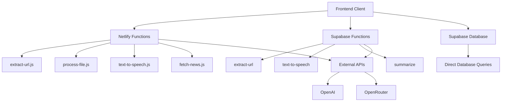

# API Reference - How It Works

## Overview
TLDRit's API architecture combines Netlify Functions for serverless processing and Supabase Edge Functions for database operations. The API provides endpoints for content processing, AI summarization, audio generation, and news aggregation with secure authentication and rate limiting.

## API Architecture

### Endpoint Distribution


## Authentication

### JWT Token Authentication
All API endpoints require authentication via JWT tokens provided by Supabase Auth.

```typescript
// Authentication header format
headers: {
  'Authorization': `Bearer ${accessToken}`,
  'Content-Type': 'application/json'
}
```

### Token Validation
```javascript
// Server-side token validation
const authHeader = event.headers.authorization;
if (!authHeader || !authHeader.startsWith('Bearer ')) {
  return {
    statusCode: 401,
    body: JSON.stringify({ error: 'Unauthorized' })
  };
}

const token = authHeader.substring(7);
// Validate token with Supabase
```

## Netlify Functions

### 1. Extract URL Content

#### Endpoint
```
POST /.netlify/functions/extract-url
```

#### Purpose
Extracts text content from web pages for summarization.

#### Request
```typescript
interface ExtractUrlRequest {
  url: string;
}
```

#### Response
```typescript
interface ExtractUrlResponse {
  content: string;
  url: string;
}
```

#### Implementation Details
```javascript
// Content extraction logic
const dom = new JSDOM(html);
const document = dom.window.document;

// Priority-based content selectors
const contentSelectors = [
  'article',
  'main',
  '.content',
  '.post-content',
  '.entry-content',
  '.article-content',
  '.story-body',
  '#content'
];

// Extract and clean content
content = content
  .replace(/\s*\n\s*\n\s*/g, '\n\n')
  .replace(/\s*\n\s*/g, ' ')
  .replace(/\s+/g, ' ')
  .trim();
```

#### Error Handling
- **400**: Invalid URL format
- **404**: URL not accessible
- **500**: Content extraction failed
- **503**: External service unavailable

### 2. Process File Content

#### Endpoint
```
POST /.netlify/functions/process-file
```

#### Purpose
Extracts text content from uploaded files (PDF, DOCX, TXT).

#### Request
```typescript
// FormData with file upload
const formData = new FormData();
formData.append('file', file);
```

#### Response
```typescript
interface ProcessFileResponse {
  content: string;
  filename: string;
  fileType: string;
  size: number;
}
```

#### Supported File Types
- **PDF**: Using pdf-parse library
- **DOCX**: Using mammoth library
- **TXT**: Direct text extraction

#### Implementation
```javascript
// Multi-format file processing
if (fileType === 'application/pdf') {
  const pdfData = await pdfParse(buffer);
  content = pdfData.text;
} else if (fileType.includes('word')) {
  const result = await mammoth.extractRawText({ buffer });
  content = result.value;
} else if (fileType === 'text/plain') {
  content = buffer.toString('utf-8');
}
```

#### File Size Limits
- **Free Users**: 5MB maximum
- **Premium Users**: 20MB maximum

### 3. Text-to-Speech Generation

#### Endpoint
```
POST /.netlify/functions/text-to-speech
```

#### Purpose
Generates audio files from text using OpenAI TTS.

#### Request
```typescript
interface TextToSpeechRequest {
  text: string;
  isPremium: boolean;
  voice?: string;
  speed?: number;
}
```

#### Response
```typescript
interface TextToSpeechResponse {
  audioUrl: string;
  filename: string;
  size: number;
  duration?: number;
}
```

#### Voice Options
- **alloy**: Balanced, natural-sounding
- **echo**: Clear, professional tone
- **fable**: Warm, storytelling voice
- **onyx**: Deep, authoritative voice
- **nova**: Bright, energetic voice
- **shimmer**: Soft, gentle voice

#### Implementation
```javascript
// OpenAI TTS generation
const mp3 = await openai.audio.speech.create({
  model: 'tts-1-hd',
  voice: 'alloy',
  input: text,
  response_format: 'mp3',
  speed: 1.0,
});

const buffer = Buffer.from(await mp3.arrayBuffer());
const base64Audio = buffer.toString('base64');
const audioUrl = `data:audio/mp3;base64,${base64Audio}`;
```

#### Premium Requirements
- Audio generation requires premium subscription
- Free users receive 403 Forbidden error

### 4. News Aggregation

#### Endpoint
```
GET /.netlify/functions/fetch-news
```

#### Purpose
Aggregates and summarizes news from RSS feeds.

#### Authentication
Requires valid JWT token for user identification.

#### Process Flow
1. Fetch RSS feeds from configured sources
2. Extract article content
3. Generate AI summaries
4. Store in database
5. Return success status

#### RSS Feed Sources
```javascript
const RSS_FEEDS = {
  technology: [
    'https://feeds.feedburner.com/TechCrunch',
    'https://www.theverge.com/rss/index.xml',
    'https://feeds.arstechnica.com/arstechnica/index'
  ],
  world: [
    'https://feeds.bbci.co.uk/news/world/rss.xml',
    'https://rss.cnn.com/rss/edition.rss'
  ],
  // ... more categories
};
```

## Supabase Edge Functions

### 1. Extract URL (Alternative)

#### Endpoint
```
POST /functions/v1/extract-url
```

#### Purpose
Alternative URL extraction using Supabase Edge Runtime.

#### Advantages
- Closer to database
- Better for authenticated operations
- Automatic scaling

#### Implementation
```typescript
import { serve } from 'https://deno.land/std@0.168.0/http/server.ts'

serve(async (req) => {
  const { url } = await req.json()
  
  // Extract content logic
  const response = await fetch(url)
  const html = await response.text()
  
  // Parse and clean content
  const content = extractMainContent(html)
  
  return new Response(JSON.stringify({ content }))
})
```

### 2. Text-to-Speech (Alternative)

#### Endpoint
```
POST /functions/v1/text-to-speech
```

#### Purpose
Alternative TTS generation with Supabase integration.

#### Benefits
- Direct database access
- User authentication validation
- Integrated with Supabase ecosystem

### 3. AI Summarization

#### Endpoint
```
POST /functions/v1/summarize
```

#### Purpose
Direct AI summarization endpoint with model routing.

#### Request
```typescript
interface SummarizeRequest {
  content: string;
  options: {
    isPremium: boolean;
    isEli5: boolean;
    summaryLevel: number;
    eli5Level?: number;
  };
}
```

#### Model Selection Logic
```typescript
// Determine API based on user tier and content length
const useOpenRouter = isPremium && content.length > 1000;
const model = useOpenRouter 
  ? 'anthropic/claude-3-opus'
  : 'gpt-3.5-turbo';
```

## Database API (Supabase Client)

### Direct Database Operations
The frontend uses Supabase client for direct database operations with RLS protection.

#### User Profile Operations
```typescript
// Get current user profile
const { data: profile } = await supabase
  .from('profiles')
  .select('*')
  .eq('id', userId)
  .single();

// Update user interests
const { error } = await supabase
  .from('profiles')
  .update({ interests })
  .eq('id', userId);
```

#### Summary Operations
```typescript
// Save new summary
const { data, error } = await supabase
  .from('summaries')
  .insert({
    user_id: userId,
    title: title,
    original_content: originalContent,
    summary: summary,
    is_eli5: isEli5,
    summary_level: summaryLevel,
  })
  .select();

// Get user summaries
const { data: summaries } = await supabase
  .from('summaries')
  .select('*')
  .eq('user_id', userId)
  .order('created_at', { ascending: false });
```

#### News Operations
```typescript
// Get personalized news feed
const { data: news } = await supabase
  .from('news')
  .select('*')
  .in('category', userInterests)
  .order('published_at', { ascending: false })
  .limit(20);
```

## Error Handling

### Standard Error Responses
All API endpoints follow consistent error response format:

```typescript
interface ApiError {
  error: string;
  details?: string;
  code?: string;
  timestamp?: string;
}
```

### HTTP Status Codes
- **200**: Success
- **400**: Bad Request (invalid input)
- **401**: Unauthorized (missing/invalid token)
- **403**: Forbidden (insufficient permissions)
- **404**: Not Found (resource doesn't exist)
- **429**: Too Many Requests (rate limited)
- **500**: Internal Server Error
- **503**: Service Unavailable

### Error Examples
```javascript
// Authentication error
{
  "error": "Unauthorized",
  "details": "Invalid or expired token",
  "code": "AUTH_INVALID_TOKEN"
}

// Premium feature error
{
  "error": "Premium subscription required",
  "details": "Audio generation is a premium feature",
  "code": "PREMIUM_REQUIRED"
}

// Rate limit error
{
  "error": "Rate limit exceeded",
  "details": "Maximum 5 summaries per day for free users",
  "code": "RATE_LIMIT_EXCEEDED"
}
```

## Rate Limiting

### Free Tier Limits
```typescript
const FREE_LIMITS = {
  summaries: 5,        // per day
  audioGeneration: 0,  // not allowed
  fileSize: 5242880,   // 5MB
  textLength: 5000,    // characters
};
```

### Premium Tier Limits
```typescript
const PREMIUM_LIMITS = {
  summaries: Infinity, // unlimited
  audioGeneration: 50, // per day
  fileSize: 20971520,  // 20MB
  textLength: 50000,   // characters
};
```

### Rate Limiting Implementation
```javascript
// Check user limits before processing
const usage = await getUserDailyUsage(userId);
if (!isPremium && usage.summaries >= FREE_LIMITS.summaries) {
  return {
    statusCode: 429,
    body: JSON.stringify({
      error: 'Rate limit exceeded',
      code: 'DAILY_LIMIT_REACHED'
    })
  };
}
```

## API Security

### CORS Configuration
```javascript
const corsHeaders = {
  'Access-Control-Allow-Origin': '*',
  'Access-Control-Allow-Headers': 'Content-Type, Authorization',
  'Access-Control-Allow-Methods': 'GET, POST, PUT, DELETE, OPTIONS',
};
```

### Input Validation
```javascript
// URL validation
function isValidUrl(string) {
  try {
    new URL(string);
    return true;
  } catch (_) {
    return false;
  }
}

// File type validation
const allowedTypes = ['application/pdf', 'text/plain', 'application/vnd.openxmlformats-officedocument.wordprocessingml.document'];
if (!allowedTypes.includes(fileType)) {
  throw new Error('Unsupported file type');
}
```

### Content Sanitization
```javascript
// Clean extracted content
function sanitizeContent(content) {
  return content
    .replace(/<script\b[^<]*(?:(?!<\/script>)<[^<]*)*<\/script>/gi, '')
    .replace(/<[^>]*>/g, '')
    .replace(/\s+/g, ' ')
    .trim();
}
```

## Performance Optimization

### Caching Strategy
- **CDN Caching**: Static assets cached at edge
- **Function Caching**: Repeated requests cached
- **Database Caching**: Query results cached
- **Browser Caching**: Client-side response caching

### Response Compression
```javascript
// Compress large responses
const zlib = require('zlib');

if (responseSize > 1024) {
  const compressed = zlib.gzipSync(JSON.stringify(data));
  return {
    statusCode: 200,
    headers: {
      ...corsHeaders,
      'Content-Encoding': 'gzip',
      'Content-Type': 'application/json'
    },
    body: compressed.toString('base64'),
    isBase64Encoded: true
  };
}
```

### Connection Pooling
- Supabase handles database connection pooling
- HTTP keep-alive for external API calls
- Connection reuse for multiple requests

## Monitoring and Analytics

### API Metrics
- Request count and response times
- Error rates by endpoint
- User activity patterns
- Resource utilization

### Logging
```javascript
// Structured logging
console.log(JSON.stringify({
  timestamp: new Date().toISOString(),
  level: 'INFO',
  endpoint: '/extract-url',
  userId: userId,
  duration: Date.now() - startTime,
  status: 200
}));
```

### Health Checks
```javascript
// Health check endpoint
exports.handler = async (event) => {
  const health = {
    status: 'healthy',
    timestamp: new Date().toISOString(),
    services: {
      database: await checkDatabase(),
      openai: await checkOpenAI(),
      storage: await checkStorage()
    }
  };
  
  return {
    statusCode: 200,
    body: JSON.stringify(health)
  };
};
```

## API Versioning

### Version Strategy
- URL-based versioning: `/v1/endpoint`
- Header-based versioning: `API-Version: 1.0`
- Backward compatibility maintained

### Migration Path
```typescript
// Version-aware endpoint handling
const apiVersion = event.headers['api-version'] || '1.0';

switch (apiVersion) {
  case '1.0':
    return handleV1Request(event);
  case '2.0':
    return handleV2Request(event);
  default:
    return handleLatestRequest(event);
}
```

## Future API Enhancements

### Planned Features
- [ ] GraphQL endpoint for complex queries
- [ ] WebSocket support for real-time updates
- [ ] Batch processing endpoints
- [ ] Advanced filtering and search
- [ ] API key management for third-party access
- [ ] Webhook support for integrations
- [ ] Advanced analytics endpoints
- [ ] Multi-language support
- [ ] Custom model fine-tuning endpoints
