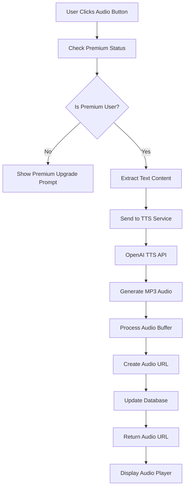
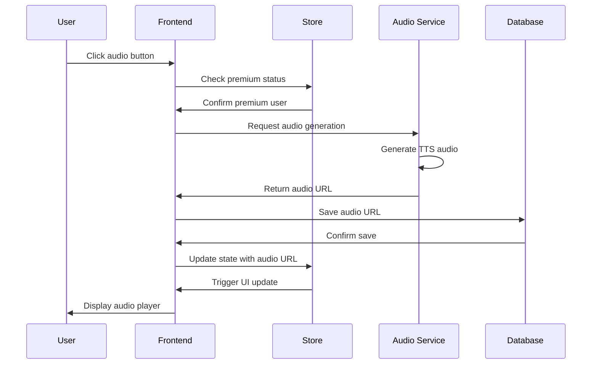

# Audio Generation System - How It Works

## Overview
The audio generation system provides text-to-speech (TTS) capabilities for summaries and news articles, enabling users to listen to content hands-free. The system integrates with premium AI voice services and provides high-quality audio output with caching and playback controls.

## User Flow

### Audio Generation Flow
1. **Content Selection**: User clicks audio button on summary or news item
2. **Premium Check**: System verifies user has premium subscription
3. **TTS Processing**: Text is sent to AI voice service for audio generation
4. **Audio Storage**: Generated audio file is stored and URL is saved
5. **Playback**: Audio player is displayed with playback controls
6. **Caching**: Audio URL is cached for future instant playback

### Audio Playback Flow
1. **Audio Request**: User initiates audio playback
2. **URL Retrieval**: System fetches stored audio URL from database
3. **Player Loading**: Audio player loads the audio file
4. **Playback Controls**: User can play, pause, seek, and control volume
5. **Background Play**: Audio continues playing during navigation

## Technical Implementation

### Frontend Components

#### Audio Integration in Summary Store
```typescript
// Summary Store audio generation
generateAudioForSummary: async (summaryId: string) => {
  const user = useAuthStore.getState().user;
  if (!user) return;
  
  const summary = get().summaries.find(s => s.id === summaryId);
  if (!summary) return;
  
  set({ isLoading: true, error: null });
  try {
    // Generate audio using TTS service
    const audioUrl = await generateAudio(summary.summary, user.isPremium);
    
    // Update summary with audio URL
    const updatedSummary = { ...summary, audioUrl };
    
    // Update local state
    set(state => ({
      summaries: state.summaries.map(s => 
        s.id === summaryId ? updatedSummary : s
      ),
      currentSummary: state.currentSummary?.id === summaryId 
        ? updatedSummary 
        : state.currentSummary,
      isLoading: false,
      error: null,
    }));
  } catch (err) {
    set({ 
      error: 'Failed to generate audio', 
      isLoading: false 
    });
  }
}
```

#### Audio Integration in News Store
```typescript
// News Store audio generation
generateAudioForNewsItem: async (newsItemId: string) => {
  const user = useAuthStore.getState().user;
  if (!user) return;
  
  const newsItem = get().newsItems.find(item => item.id === newsItemId);
  if (!newsItem) return;
  
  set({ isLoading: true, error: null });
  try {
    const audioUrl = await generateAudio(newsItem.summary, user.isPremium);
    
    set(state => ({
      newsItems: state.newsItems.map(item => 
        item.id === newsItemId 
          ? { ...item, audioUrl } 
          : item
      ),
      isLoading: false,
      error: null,
    }));
  } catch {
    set({ 
      error: 'Failed to generate audio', 
      isLoading: false 
    });
  }
}
```

### AI Integration (`src/lib/ai.ts`)

#### Audio Generation Function
```typescript
export async function generateAudio(text: string, isPremium: boolean) {
  // Get the current user's session and access token
  const { data } = await supabase.auth.getSession();
  const token = data.session?.access_token;
  if (!token) {
    throw new Error('User must be authenticated to generate audio');
  }

  try {
    const response = await axios.post('/api/text-to-speech', {
      text,
      isPremium,
    }, {
      headers: {
        'Authorization': `Bearer ${token}`,
        'Content-Type': 'application/json',
      }
    });

    return response.data.audioUrl;
  } catch (error) {
    console.error('Error generating audio:', error);
    throw new Error('Failed to generate audio');
  }
}
```

### Backend Implementation

#### Netlify TTS Function (`netlify/functions/text-to-speech.js`)
```javascript
const OpenAI = require('openai');

const openai = new OpenAI({
  apiKey: process.env.OPENAI_API_KEY,
});

exports.handler = async function(event, context) {
  // Handle CORS
  const headers = {
    'Access-Control-Allow-Origin': '*',
    'Access-Control-Allow-Headers': 'Content-Type, Authorization',
    'Access-Control-Allow-Methods': 'POST, OPTIONS',
  };

  if (event.httpMethod === 'OPTIONS') {
    return { statusCode: 200, headers, body: '' };
  }

  if (event.httpMethod !== 'POST') {
    return {
      statusCode: 405,
      headers,
      body: JSON.stringify({ error: 'Method not allowed' }),
    };
  }

  try {
    // Verify authentication
    const authHeader = event.headers.authorization;
    if (!authHeader || !authHeader.startsWith('Bearer ')) {
      return {
        statusCode: 401,
        headers,
        body: JSON.stringify({ error: 'Unauthorized' }),
      };
    }

    const { text, isPremium } = JSON.parse(event.body);

    if (!text) {
      return {
        statusCode: 400,
        headers,
        body: JSON.stringify({ error: 'Text is required' }),
      };
    }

    // Check premium status for audio generation
    if (!isPremium) {
      return {
        statusCode: 403,
        headers,
        body: JSON.stringify({ 
          error: 'Audio generation requires premium subscription' 
        }),
      };
    }

    // Generate audio using OpenAI TTS
    const mp3 = await openai.audio.speech.create({
      model: 'tts-1-hd', // High quality model for premium users
      voice: 'alloy',    // Natural sounding voice
      input: text,
      response_format: 'mp3',
      speed: 1.0,
    });

    // Convert to buffer
    const buffer = Buffer.from(await mp3.arrayBuffer());
    
    // Generate unique filename
    const filename = `audio_${Date.now()}_${Math.random().toString(36).substr(2, 9)}.mp3`;
    
    // In production, upload to cloud storage (S3, Cloudinary, etc.)
    // For now, return base64 data URL
    const base64Audio = buffer.toString('base64');
    const audioUrl = `data:audio/mp3;base64,${base64Audio}`;

    return {
      statusCode: 200,
      headers,
      body: JSON.stringify({
        audioUrl,
        filename,
        size: buffer.length,
      }),
    };

  } catch (error) {
    console.error('Error generating audio:', error);
    return {
      statusCode: 500,
      headers,
      body: JSON.stringify({ 
        error: 'Failed to generate audio',
        details: error.message 
      }),
    };
  }
};
```

#### Supabase TTS Function (`supabase/functions/text-to-speech/index.ts`)
```typescript
import { serve } from 'https://deno.land/std@0.168.0/http/server.ts'
import { createClient } from 'https://esm.sh/@supabase/supabase-js@2'

const corsHeaders = {
  'Access-Control-Allow-Origin': '*',
  'Access-Control-Allow-Headers': 'authorization, x-client-info, apikey, content-type',
}

serve(async (req) => {
  // Handle CORS
  if (req.method === 'OPTIONS') {
    return new Response('ok', { headers: corsHeaders })
  }

  try {
    // Verify authentication
    const authHeader = req.headers.get('Authorization')
    if (!authHeader) {
      throw new Error('No authorization header')
    }

    const supabase = createClient(
      Deno.env.get('SUPABASE_URL') ?? '',
      Deno.env.get('SUPABASE_ANON_KEY') ?? '',
      { global: { headers: { Authorization: authHeader } } }
    )

    // Get user from token
    const { data: { user }, error: userError } = await supabase.auth.getUser()
    if (userError || !user) {
      throw new Error('Invalid user token')
    }

    const { text, isPremium } = await req.json()

    if (!text) {
      throw new Error('Text is required')
    }

    if (!isPremium) {
      throw new Error('Audio generation requires premium subscription')
    }

    // Generate audio using OpenAI TTS
    const openaiResponse = await fetch('https://api.openai.com/v1/audio/speech', {
      method: 'POST',
      headers: {
        'Authorization': `Bearer ${Deno.env.get('OPENAI_API_KEY')}`,
        'Content-Type': 'application/json',
      },
      body: JSON.stringify({
        model: 'tts-1-hd',
        voice: 'alloy',
        input: text,
        response_format: 'mp3',
        speed: 1.0,
      }),
    })

    if (!openaiResponse.ok) {
      throw new Error('Failed to generate audio')
    }

    const audioBuffer = await openaiResponse.arrayBuffer()
    const base64Audio = btoa(String.fromCharCode(...new Uint8Array(audioBuffer)))
    const audioUrl = `data:audio/mp3;base64,${base64Audio}`

    return new Response(
      JSON.stringify({ audioUrl }),
      {
        headers: { ...corsHeaders, 'Content-Type': 'application/json' },
        status: 200,
      },
    )
  } catch (error) {
    return new Response(
      JSON.stringify({ error: error.message }),
      {
        headers: { ...corsHeaders, 'Content-Type': 'application/json' },
        status: 400,
      },
    )
  }
})
```

## Audio Processing Pipeline

### TTS Generation Flow


### Audio Playback Architecture


## Voice Configuration

### Voice Models and Quality
```typescript
const VOICE_MODELS = {
  free: {
    model: 'tts-1',        // Standard quality
    voice: 'alloy',        // Default voice
    speed: 1.0,
    format: 'mp3'
  },
  premium: {
    model: 'tts-1-hd',     // High definition quality
    voice: 'alloy',        // Natural sounding voice
    speed: 1.0,
    format: 'mp3'
  }
};
```

### Available Voices
- **alloy**: Balanced, natural-sounding voice
- **echo**: Clear, professional tone
- **fable**: Warm, storytelling voice
- **onyx**: Deep, authoritative voice
- **nova**: Bright, energetic voice
- **shimmer**: Soft, gentle voice

### Audio Quality Settings
```typescript
const AUDIO_SETTINGS = {
  sampleRate: 22050,     // Hz
  bitRate: 64,           // kbps for standard, 128 for premium
  channels: 1,           // Mono audio
  format: 'mp3',         // Compressed format
  speed: 1.0,            // Normal playback speed
};
```

## Audio Storage and Caching

### Storage Strategy
```typescript
// Audio URL storage in database
interface AudioStorage {
  summaryId?: string;
  newsItemId?: string;
  audioUrl: string;
  createdAt: string;
  fileSize: number;
  duration?: number;
}
```

### Caching Implementation
- **Memory Cache**: Audio URLs cached in Zustand store
- **Database Cache**: Audio URLs persisted in database
- **Browser Cache**: Audio files cached by browser
- **CDN Cache**: Future implementation for cloud storage

### Cache Invalidation
- Audio URLs expire after 30 days
- Manual cache clearing for storage management
- Automatic cleanup of unused audio files
- User-initiated cache refresh

## Audio Player Features

### Playback Controls
```typescript
interface AudioPlayerState {
  isPlaying: boolean;
  currentTime: number;
  duration: number;
  volume: number;
  playbackRate: number;
  isLoading: boolean;
  error: string | null;
}
```

### Player Functionality
- **Play/Pause**: Basic playback control
- **Seek**: Jump to specific time positions
- **Volume Control**: Adjustable audio volume
- **Speed Control**: Variable playback speed (0.5x - 2x)
- **Progress Bar**: Visual playback progress
- **Time Display**: Current time and total duration

### Background Playback
- Audio continues during page navigation
- Persistent player controls in header/footer
- Queue management for multiple audio items
- Auto-play next item in queue

## Premium Features

### Free Tier Limitations
```typescript
const FREE_AUDIO_LIMITS = {
  dailyGenerations: 0,        // No audio generation
  maxDuration: 0,             // No audio content
  quality: 'none',            // No audio access
  voices: [],                 // No voice options
};
```

### Premium Tier Benefits
```typescript
const PREMIUM_AUDIO_FEATURES = {
  dailyGenerations: Infinity, // Unlimited audio generation
  maxDuration: 600,           // 10 minutes per audio
  quality: 'hd',              // High-definition audio
  voices: ['alloy', 'echo', 'fable', 'onyx', 'nova', 'shimmer'],
  speedControl: true,         // Variable playback speed
  backgroundPlay: true,       // Background playback
  downloadOption: true,       // Download audio files
};
```

## Error Handling

### Common Error Scenarios
```typescript
// Audio generation errors
const AUDIO_ERRORS = {
  UNAUTHORIZED: 'User must be authenticated',
  PREMIUM_REQUIRED: 'Audio generation requires premium subscription',
  TEXT_TOO_LONG: 'Text exceeds maximum length for audio generation',
  SERVICE_UNAVAILABLE: 'Audio service temporarily unavailable',
  NETWORK_ERROR: 'Network connection failed',
  INVALID_FORMAT: 'Unsupported audio format',
};
```

### Error Recovery
- Automatic retry for transient failures
- Fallback to cached audio when available
- User-friendly error messages
- Option to retry audio generation
- Graceful degradation to text-only mode

### User Feedback
```typescript
// Error handling in components
const handleAudioError = (error: string) => {
  switch (error) {
    case 'PREMIUM_REQUIRED':
      showUpgradePrompt();
      break;
    case 'NETWORK_ERROR':
      showRetryOption();
      break;
    default:
      showGenericError(error);
  }
};
```

## Performance Optimizations

### Audio Compression
- MP3 format for optimal size/quality balance
- Variable bitrate encoding
- Compression settings based on content type
- Progressive loading for large audio files

### Loading Optimizations
- Lazy loading of audio players
- Preloading for predicted user actions
- Progressive audio streaming
- Background audio generation

### Bandwidth Management
- Adaptive quality based on connection speed
- Audio compression for mobile users
- Efficient caching strategies
- CDN delivery for global performance

## Security and Privacy

### Audio Content Security
- Secure audio URL generation
- Time-limited audio access tokens
- Encrypted audio transmission
- User data protection in audio metadata

### Privacy Considerations
- No audio content stored permanently
- User consent for audio generation
- GDPR-compliant audio processing
- Option to delete generated audio

## Integration Points

### Authentication Integration
- Premium status verification for audio access
- User session validation for audio requests
- Secure token-based audio generation
- Account-based audio history

### Content Integration
- Seamless audio generation from summaries
- News article audio integration
- Consistent audio quality across features
- Unified audio player experience

## Benefits and Limitations

### Benefits
- **Accessibility**: Hands-free content consumption
- **Multitasking**: Listen while doing other activities
- **High Quality**: Professional-grade voice synthesis
- **Convenience**: Instant audio generation
- **Personalization**: Multiple voice options

### Limitations
- **Premium Only**: Audio features require subscription
- **Internet Dependency**: Requires connection for generation
- **Storage Costs**: Audio files consume storage space
- **Processing Time**: TTS generation takes time
- **Language Support**: Limited to supported languages

## Future Enhancements

### Planned Features
- [ ] Multiple voice options for users
- [ ] Custom voice speed preferences
- [ ] Audio playlist creation
- [ ] Offline audio download
- [ ] Voice cloning for personalization
- [ ] Multi-language TTS support
- [ ] Audio transcription features
- [ ] Social audio sharing
- [ ] Podcast-style audio feeds
- [ ] AI-powered audio summaries
