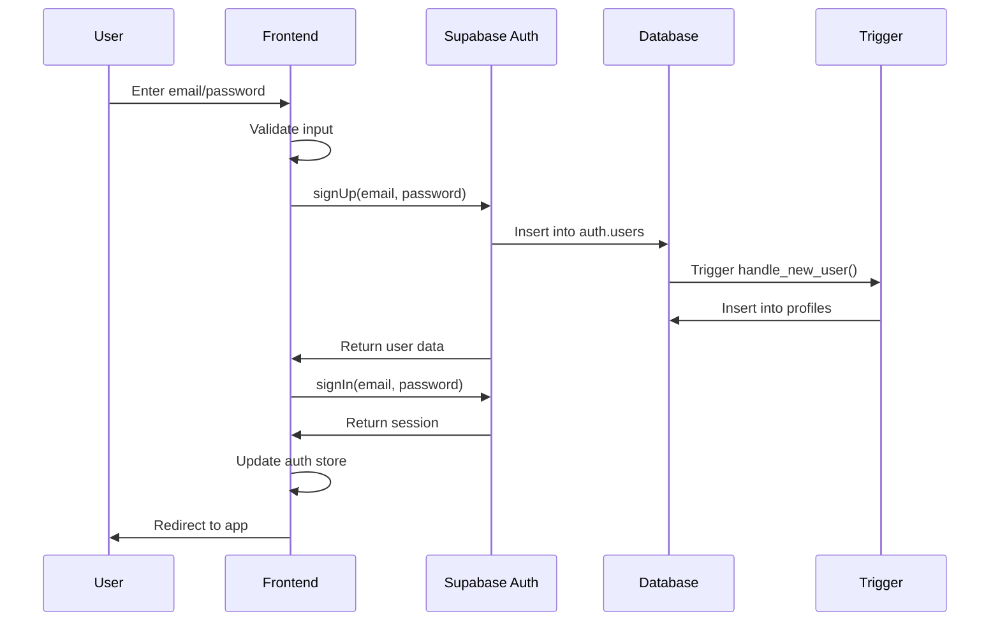
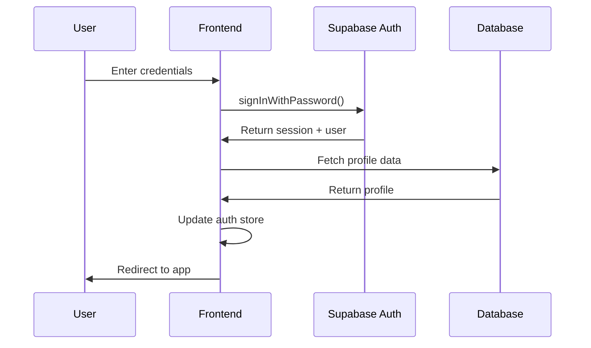
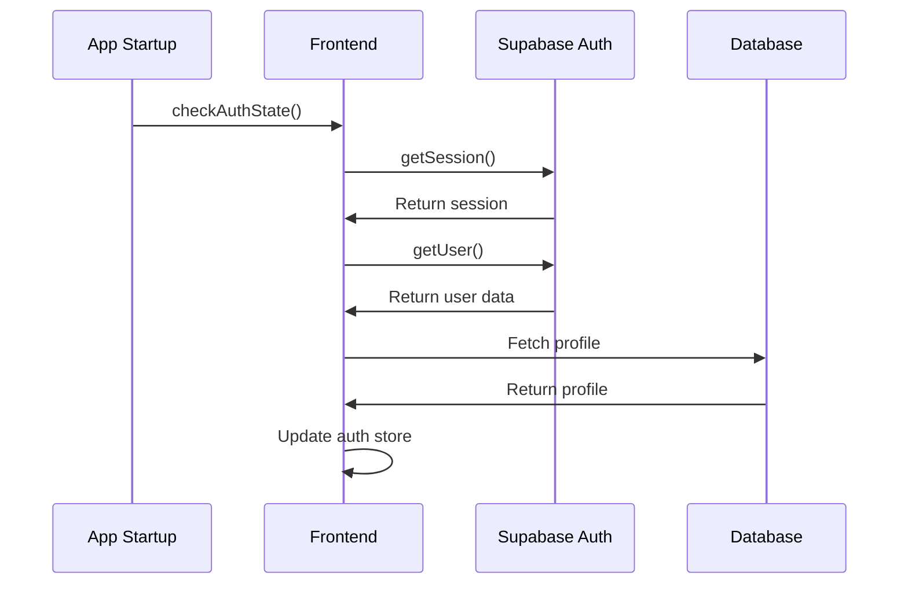

# Authentication System - How It Works

## Overview
TLDRit uses Supabase Auth for a complete authentication system with email/password login, user profiles, and session management. The system provides secure user authentication with automatic profile creation and persistent sessions.

## User Flow

### Registration Flow
1. **User Input**: User enters email and password on registration form
2. **Validation**: Frontend validates email format and password strength
3. **Supabase Auth**: Creates user account in `auth.users` table
4. **Profile Creation**: Database trigger automatically creates profile record
5. **Auto-Login**: System automatically logs user in after successful registration
6. **Redirect**: User is redirected to the main application

### Login Flow
1. **User Input**: User enters credentials on login form
2. **Authentication**: Supabase validates credentials
3. **Session Creation**: JWT token is generated and stored
4. **Profile Fetch**: User profile data is retrieved from database
5. **State Update**: Auth store is updated with user data
6. **Redirect**: User is redirected to intended destination

### Session Management
1. **Persistence**: Sessions are stored in localStorage via Zustand persist
2. **Auto-Check**: App checks auth state on startup
3. **Token Refresh**: Supabase automatically refreshes expired tokens
4. **Logout**: Clears session and redirects to login

## Technical Implementation

### Frontend Components

#### Auth Store (`src/store/authStore.ts`)
```typescript
interface AuthState {
  user: User | null;
  isLoading: boolean;
  error: string | null;
  isAuthenticated: boolean;
  login: (email: string, password: string) => Promise<void>;
  register: (email: string, password: string) => Promise<void>;
  logout: () => Promise<void>;
  checkAuthState: () => Promise<void>;
}
```

**Key Features:**
- Zustand store with persistence middleware
- Automatic session restoration
- Error handling and loading states
- Type-safe user data management

#### Login Form (`src/components/auth/LoginForm.tsx`)
- Email/password input validation
- Error display and handling
- Loading states during authentication
- Responsive design with Tailwind CSS

#### Register Form (`src/components/auth/RegisterForm.tsx`)
- User registration with validation
- Password confirmation
- Terms of service acceptance
- Automatic login after registration

#### Protected Routes (`src/App.tsx`)
```typescript
const ProtectedRoute = ({ children }: { children: React.ReactNode }) => {
  const { isAuthenticated, isLoading } = useAuthStore();
  
  if (isLoading) return <div>Loading...</div>;
  if (!isAuthenticated) return <Navigate to="/login" replace />;
  return <>{children}</>;
};
```

### Backend Implementation

#### Database Schema
```sql
-- Supabase auth.users table (managed by Supabase)
auth.users (
  id UUID PRIMARY KEY,
  email TEXT UNIQUE,
  encrypted_password TEXT,
  email_confirmed_at TIMESTAMPTZ,
  created_at TIMESTAMPTZ,
  updated_at TIMESTAMPTZ
)

-- Custom profiles table
profiles (
  id UUID REFERENCES auth.users(id) PRIMARY KEY,
  username TEXT UNIQUE,
  full_name TEXT,
  avatar_url TEXT,
  is_admin BOOLEAN DEFAULT false,
  is_premium BOOLEAN DEFAULT false,
  eli5_age INTEGER DEFAULT 5,
  interests TEXT[] DEFAULT '{}',
  updated_at TIMESTAMPTZ DEFAULT now()
)
```

#### Row Level Security (RLS)
```sql
-- Users can only view their own profile
CREATE POLICY "Users can view their own profile"
  ON profiles FOR SELECT
  USING (auth.uid() = id);

-- Users can only update their own profile
CREATE POLICY "Users can update their own profile"
  ON profiles FOR UPDATE
  USING (auth.uid() = id);
```

#### Automatic Profile Creation
```sql
-- Trigger function to create profile on user signup
CREATE OR REPLACE FUNCTION public.handle_new_user()
RETURNS TRIGGER AS $$
BEGIN
  INSERT INTO public.profiles (id)
  VALUES (NEW.id);
  RETURN NEW;
END;
$$ LANGUAGE plpgsql SECURITY DEFINER;

-- Trigger that fires on user creation
CREATE TRIGGER on_auth_user_created
  AFTER INSERT ON auth.users
  FOR EACH ROW EXECUTE FUNCTION public.handle_new_user();
```

### Supabase Integration (`src/lib/supabase.ts`)

#### Authentication Functions
```typescript
export async function signUp(email: string, password: string) {
  const { data, error } = await supabase.auth.signUp({
    email,
    password,
  });
  return { data, error };
}

export async function signIn(email: string, password: string) {
  const { data, error } = await supabase.auth.signInWithPassword({
    email,
    password,
  });
  return { data, error };
}

export async function signOut() {
  const { error } = await supabase.auth.signOut();
  return { error };
}

export async function getCurrentUser() {
  // Check session validity
  const { data: sessionData, error: sessionError } = await supabase.auth.getSession();
  if (sessionError || !sessionData?.session) {
    return { user: null, error: sessionError };
  }

  // Get user from auth
  const { data, error } = await supabase.auth.getUser();
  if (error || !data?.user) {
    return { user: null, error };
  }

  // Get profile data
  const { data: profile, error: profileError } = await supabase
    .from('profiles')
    .select('*')
    .eq('id', data.user.id)
    .single();

  return {
    user: {
      id: data.user.id,
      email: data.user.email,
      isPremium: profile?.is_premium || false,
      interests: profile?.interests || [],
      eli5Age: profile?.eli5_age ?? 5,
    },
    error: profileError,
  };
}
```

## Authentication Flow Diagrams

### Registration Process


### Login Process


### Session Check Process


## Security Features

### Password Security
- Supabase handles password hashing and validation
- Minimum password requirements enforced
- Secure password reset functionality
- Protection against brute force attacks

### Session Security
- JWT tokens with automatic refresh
- Secure token storage in httpOnly cookies
- Session expiration and cleanup
- CSRF protection built-in

### Data Protection
- Row Level Security (RLS) on all user data
- User data isolation at database level
- Encrypted data transmission (HTTPS)
- GDPR-compliant data handling

## Error Handling

### Common Error Scenarios
1. **Invalid Credentials**: Clear error message, no account lockout
2. **Network Errors**: Retry mechanism with user feedback
3. **Session Expiry**: Automatic token refresh or re-login prompt
4. **Email Already Exists**: Helpful error message with login link
5. **Weak Password**: Real-time validation feedback

### Error Display
```typescript
// Auth store error handling
if (error) {
  set({ 
    error: error.message, 
    isLoading: false, 
    isAuthenticated: false 
  });
  return;
}
```

## User Profile Management

### Profile Data Structure
```typescript
interface User {
  id: string;
  email: string;
  isPremium: boolean;
  interests: string[];
  eli5Age?: number;
}
```

### Profile Updates
- Users can update their preferences
- Interest selection for news feed
- ELI5 age preference for summaries
- Premium subscription status

## Integration with App Features

### Protected Routes
- Saved summaries require authentication
- Audio generation requires premium account
- Profile management requires login
- News feed personalization requires account

### User Context
- All API calls include user authentication
- User preferences affect AI model selection
- Usage limits based on subscription tier
- Personalized content recommendations

## Benefits and Limitations

### Benefits
- **Secure**: Industry-standard authentication
- **Scalable**: Handles user growth automatically
- **Feature-rich**: Built-in password reset, email verification
- **Compliant**: GDPR and privacy regulation compliant
- **Reliable**: 99.9% uptime with Supabase infrastructure

### Limitations
- **Dependency**: Relies on Supabase service availability
- **Customization**: Limited auth UI customization options
- **Cost**: Usage-based pricing for large user bases
- **Complexity**: Additional setup for custom auth flows

## Future Enhancements

### Planned Features
- [ ] Social login (Google, GitHub)
- [ ] Two-factor authentication (2FA)
- [ ] Magic link authentication
- [ ] Account deletion and data export
- [ ] Advanced user roles and permissions
- [ ] Single Sign-On (SSO) integration
