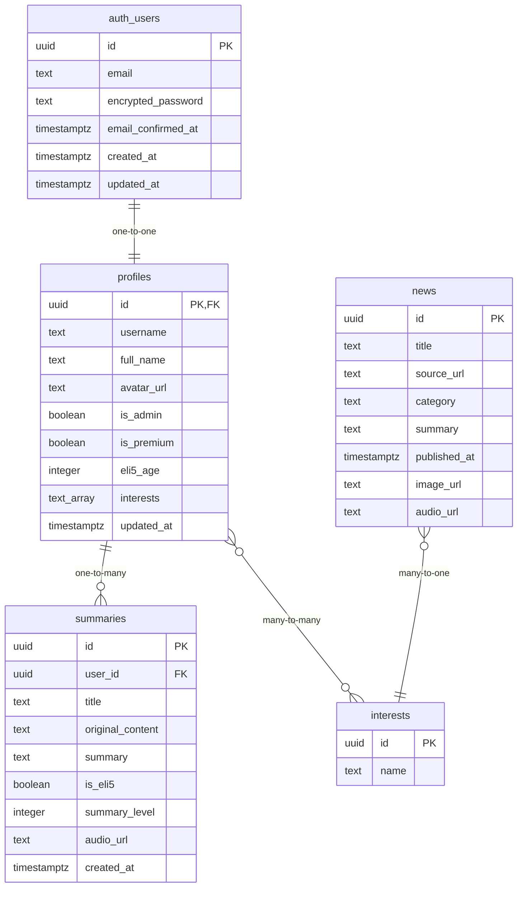

# Database Schema - How It Works

## Overview
TLDRit uses Supabase (PostgreSQL) as its primary database with a well-structured schema that supports user authentication, content summarization, news feeds, and subscription management. The database implements Row Level Security (RLS) for data protection and includes automated triggers for user management.

## Database Architecture

### Core Tables Overview


## Table Definitions

### 1. Profiles Table
The profiles table extends Supabase's built-in auth.users table with application-specific user data.

```sql
CREATE TABLE profiles (
  id UUID REFERENCES auth.users(id) PRIMARY KEY,
  updated_at TIMESTAMPTZ NOT NULL DEFAULT timezone('utc'::text, now()),
  username TEXT UNIQUE,
  full_name TEXT,
  avatar_url TEXT,
  is_admin BOOLEAN DEFAULT false,
  is_premium BOOLEAN DEFAULT false,
  eli5_age INTEGER DEFAULT 5,
  interests TEXT[] DEFAULT '{}'
);
```

**Field Descriptions:**
- `id`: Primary key, foreign key to auth.users(id)
- `updated_at`: Timestamp of last profile update
- `username`: Unique username for the user (optional)
- `full_name`: User's display name
- `avatar_url`: URL to user's profile picture
- `is_admin`: Administrative privileges flag
- `is_premium`: Premium subscription status
- `eli5_age`: Preferred age level for ELI5 explanations (5, 10, or 15)
- `interests`: Array of interest categories for news personalization

**Indexes:**
```sql
CREATE INDEX idx_profiles_username ON profiles(username);
CREATE INDEX idx_profiles_premium ON profiles(is_premium);
CREATE INDEX idx_profiles_interests ON profiles USING GIN(interests);
```

### 2. Summaries Table
Stores user-generated summaries with metadata and customization options.

```sql
CREATE TABLE summaries (
  id UUID PRIMARY KEY DEFAULT gen_random_uuid(),
  user_id UUID REFERENCES profiles(id) NOT NULL,
  title TEXT NOT NULL,
  original_content TEXT NOT NULL,
  summary TEXT NOT NULL,
  is_eli5 BOOLEAN DEFAULT false,
  summary_level INTEGER DEFAULT 3,
  audio_url TEXT,
  created_at TIMESTAMPTZ DEFAULT now()
);
```

**Field Descriptions:**
- `id`: Unique identifier for the summary
- `user_id`: Foreign key to profiles table
- `title`: Auto-generated or user-provided title
- `original_content`: Original input (text, URL, or filename)
- `summary`: AI-generated summary text
- `is_eli5`: Whether this is an ELI5 explanation
- `summary_level`: Summary detail level (1-4)
- `audio_url`: URL to generated audio file (premium feature)
- `created_at`: Timestamp of summary creation

**Indexes:**
```sql
CREATE INDEX idx_summaries_user_id ON summaries(user_id);
CREATE INDEX idx_summaries_created_at ON summaries(created_at DESC);
CREATE INDEX idx_summaries_eli5 ON summaries(is_eli5);
CREATE INDEX idx_summaries_level ON summaries(summary_level);
```

### 3. News Table
Stores aggregated and summarized news articles from RSS feeds.

```sql
CREATE TABLE news (
  id UUID PRIMARY KEY DEFAULT gen_random_uuid(),
  title TEXT NOT NULL,
  source_url TEXT NOT NULL,
  category TEXT NOT NULL,
  summary TEXT NOT NULL,
  published_at TIMESTAMPTZ DEFAULT now(),
  image_url TEXT,
  audio_url TEXT
);
```

**Field Descriptions:**
- `id`: Unique identifier for the news item
- `title`: Article headline
- `source_url`: Original article URL
- `category`: News category (technology, world, business, etc.)
- `summary`: AI-generated article summary
- `published_at`: Article publication timestamp
- `image_url`: Featured image URL (optional)
- `audio_url`: Generated audio summary URL (optional)

**Indexes:**
```sql
CREATE INDEX idx_news_category ON news(category);
CREATE INDEX idx_news_published_at ON news(published_at DESC);
CREATE INDEX idx_news_source_url ON news(source_url);
CREATE UNIQUE INDEX idx_news_unique_url ON news(source_url);
```

### 4. Interests Table
Defines available interest categories for news personalization.

```sql
CREATE TABLE interests (
  id UUID PRIMARY KEY DEFAULT gen_random_uuid(),
  name TEXT UNIQUE NOT NULL
);
```

**Field Descriptions:**
- `id`: Unique identifier for the interest
- `name`: Interest category name (e.g., 'technology', 'science')

**Default Data:**
```sql
INSERT INTO interests (name) VALUES
  ('technology'),
  ('world'),
  ('business'),
  ('science'),
  ('health'),
  ('entertainment'),
  ('sports'),
  ('politics'),
  ('crypto'),
  ('ai')
ON CONFLICT (name) DO NOTHING;
```

## Row Level Security (RLS)

### Security Policies Overview
All tables implement Row Level Security to ensure users can only access their own data.

### Profiles Policies
```sql
-- Enable RLS
ALTER TABLE profiles ENABLE ROW LEVEL SECURITY;

-- Users can view their own profile
CREATE POLICY "Users can view their own profile"
  ON profiles
  FOR SELECT
  USING (auth.uid() = id);

-- Users can update their own profile
CREATE POLICY "Users can update their own profile"
  ON profiles
  FOR UPDATE
  USING (auth.uid() = id);

-- Users can insert their own profile (handled by trigger)
CREATE POLICY "Users can insert their own profile"
  ON profiles
  FOR INSERT
  WITH CHECK (auth.uid() = id);
```

### Summaries Policies
```sql
-- Enable RLS
ALTER TABLE summaries ENABLE ROW LEVEL SECURITY;

-- Users can view their own summaries
CREATE POLICY "Users can view their own summaries"
  ON summaries
  FOR SELECT
  USING (auth.uid() = user_id);

-- Users can insert their own summaries
CREATE POLICY "Users can insert their own summaries"
  ON summaries
  FOR INSERT
  WITH CHECK (auth.uid() = user_id);

-- Users can update their own summaries
CREATE POLICY "Users can update their own summaries"
  ON summaries
  FOR UPDATE
  USING (auth.uid() = user_id);

-- Users can delete their own summaries
CREATE POLICY "Users can delete their own summaries"
  ON summaries
  FOR DELETE
  USING (auth.uid() = user_id);
```

### News Policies
```sql
-- Enable RLS
ALTER TABLE news ENABLE ROW LEVEL SECURITY;

-- Anyone can view news (read-only for authenticated users)
CREATE POLICY "Anyone can view news"
  ON news
  FOR SELECT
  TO authenticated
  USING (true);

-- Only admins can modify news
CREATE POLICY "Admins can manage news"
  ON news
  FOR ALL
  TO authenticated
  USING (
    EXISTS (
      SELECT 1 FROM profiles 
      WHERE profiles.id = auth.uid() 
      AND profiles.is_admin = true
    )
  );
```

### Interests Policies
```sql
-- Enable RLS
ALTER TABLE interests ENABLE ROW LEVEL SECURITY;

-- Anyone can view interests
CREATE POLICY "Anyone can view interests"
  ON interests
  FOR SELECT
  USING (true);

-- Only admins can modify interests
CREATE POLICY "Admins can manage interests"
  ON interests
  FOR ALL
  TO authenticated
  USING (
    EXISTS (
      SELECT 1 FROM profiles 
      WHERE profiles.id = auth.uid() 
      AND profiles.is_admin = true
    )
  );
```

## Database Functions and Triggers

### User Profile Creation Trigger
Automatically creates a profile when a new user signs up.

```sql
-- Function to handle new user signup
CREATE OR REPLACE FUNCTION public.handle_new_user()
RETURNS TRIGGER AS $$
BEGIN
  INSERT INTO public.profiles (id)
  VALUES (NEW.id);
  RETURN NEW;
END;
$$ LANGUAGE plpgsql SECURITY DEFINER;

-- Trigger that fires on user creation
CREATE OR REPLACE TRIGGER on_auth_user_created
  AFTER INSERT ON auth.users
  FOR EACH ROW EXECUTE FUNCTION public.handle_new_user();
```

### Profile Update Function
Updates the profile timestamp when profile data changes.

```sql
-- Function to update profile timestamp
CREATE OR REPLACE FUNCTION public.update_profile_updated_at()
RETURNS TRIGGER AS $$
BEGIN
  NEW.updated_at = timezone('utc'::text, now());
  RETURN NEW;
END;
$$ LANGUAGE plpgsql;

-- Trigger for profile updates
CREATE TRIGGER update_profiles_updated_at
  BEFORE UPDATE ON profiles
  FOR EACH ROW EXECUTE FUNCTION public.update_profile_updated_at();
```

### Summary Statistics Function
Provides summary statistics for admin dashboard.

```sql
-- Function to get summary statistics
CREATE OR REPLACE FUNCTION public.get_summary_stats()
RETURNS TABLE (
  total_summaries BIGINT,
  total_users BIGINT,
  premium_users BIGINT,
  summaries_today BIGINT,
  eli5_summaries BIGINT
) AS $$
BEGIN
  RETURN QUERY
  SELECT 
    (SELECT COUNT(*) FROM summaries) as total_summaries,
    (SELECT COUNT(*) FROM profiles) as total_users,
    (SELECT COUNT(*) FROM profiles WHERE is_premium = true) as premium_users,
    (SELECT COUNT(*) FROM summaries WHERE created_at >= CURRENT_DATE) as summaries_today,
    (SELECT COUNT(*) FROM summaries WHERE is_eli5 = true) as eli5_summaries;
END;
$$ LANGUAGE plpgsql SECURITY DEFINER;
```

## Data Relationships

### User-Summary Relationship
```sql
-- One user can have many summaries
-- Each summary belongs to exactly one user
ALTER TABLE summaries 
ADD CONSTRAINT fk_summaries_user_id 
FOREIGN KEY (user_id) REFERENCES profiles(id) ON DELETE CASCADE;
```

### User-Interests Relationship
```sql
-- Many-to-many relationship via array column
-- Users can have multiple interests
-- Interests can be selected by multiple users
-- Implemented as TEXT[] array in profiles.interests
```

### News-Category Relationship
```sql
-- News items are categorized by interest categories
-- Soft relationship (no foreign key constraint for flexibility)
-- Categories must match available interests for personalization
```

## Database Migrations

### Migration History
The database schema is managed through Supabase migrations:

1. **20250526083649_billowing_dew.sql**: Initial schema setup
2. **20250526084107_sparkling_voice.sql**: Core tables and RLS policies
3. **20250526084144_black_boat.sql**: Schema refinements and fixes
4. **20250526090856_quiet_darkness.sql**: Added interests array to profiles

### Migration Best Practices
- All schema changes go through migration files
- Migrations are idempotent and can be safely re-run
- Foreign key constraints ensure data integrity
- Indexes are created for performance optimization

## Performance Considerations

### Query Optimization
```sql
-- Efficient user summary retrieval
SELECT s.* FROM summaries s
WHERE s.user_id = $1
ORDER BY s.created_at DESC
LIMIT 20;

-- Personalized news feed query
SELECT n.* FROM news n
WHERE n.category = ANY($1::text[])  -- User interests array
ORDER BY n.published_at DESC
LIMIT 20;
```

### Index Strategy
- Primary keys automatically indexed
- Foreign keys indexed for join performance
- Timestamp columns indexed for sorting
- GIN index on interests array for efficient array operations
- Unique indexes prevent duplicate data

### Connection Pooling
- Supabase handles connection pooling automatically
- Connection limits managed by Supabase infrastructure
- Prepared statements used for common queries

## Data Backup and Recovery

### Automated Backups
- Supabase provides automated daily backups
- Point-in-time recovery available
- Cross-region backup replication
- Backup retention based on plan tier

### Data Export
```sql
-- Export user data for GDPR compliance
SELECT 
  p.*,
  array_agg(s.*) as summaries
FROM profiles p
LEFT JOIN summaries s ON p.id = s.user_id
WHERE p.id = $1
GROUP BY p.id;
```

## Security Best Practices

### Data Protection
- All sensitive data encrypted at rest
- TLS encryption for data in transit
- Row Level Security enforces data isolation
- Regular security audits and updates

### Access Control
- JWT-based authentication
- Role-based access control (admin vs user)
- API key rotation and management
- Audit logging for sensitive operations

### Privacy Compliance
- GDPR-compliant data handling
- User data deletion capabilities
- Data export functionality
- Privacy policy enforcement

## Monitoring and Analytics

### Database Metrics
- Query performance monitoring
- Connection pool utilization
- Storage usage tracking
- Error rate monitoring

### Business Metrics
```sql
-- Daily active users
SELECT COUNT(DISTINCT user_id) 
FROM summaries 
WHERE created_at >= CURRENT_DATE;

-- Premium conversion rate
SELECT 
  COUNT(*) FILTER (WHERE is_premium = true) * 100.0 / COUNT(*) as conversion_rate
FROM profiles;

-- Popular summary types
SELECT 
  is_eli5,
  summary_level,
  COUNT(*) as count
FROM summaries
GROUP BY is_eli5, summary_level
ORDER BY count DESC;
```

## Future Schema Enhancements

### Planned Additions
- **User Sessions Table**: Track user activity and engagement
- **Subscription Table**: Detailed subscription management
- **Analytics Table**: User behavior tracking
- **Feedback Table**: User feedback and ratings
- **Shared Summaries Table**: Social sharing functionality

### Scalability Considerations
- Table partitioning for large datasets
- Read replicas for improved performance
- Caching layer for frequently accessed data
- Archive strategy for old data

## Benefits and Limitations

### Benefits
- **Secure**: Row Level Security ensures data protection
- **Scalable**: PostgreSQL handles growth efficiently
- **Reliable**: Supabase provides enterprise-grade infrastructure
- **Flexible**: Schema supports complex relationships
- **Maintainable**: Clear structure and documentation

### Limitations
- **Vendor Lock-in**: Tied to Supabase ecosystem
- **Cost**: Usage-based pricing can scale with growth
- **Complexity**: RLS policies require careful management
- **Migration**: Schema changes require careful planning
