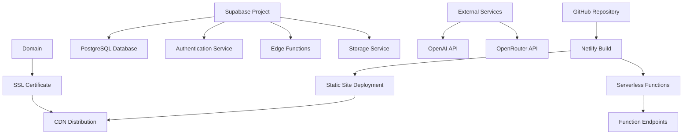

# Deployment Guide - How It Works

## Overview
TLDRit uses a modern deployment architecture with Netlify for frontend hosting and serverless functions, combined with Supabase for backend services. This guide covers the complete deployment process, environment configuration, and production considerations.

## Deployment Architecture

### Infrastructure Overview


## Prerequisites

### Required Accounts
- **GitHub**: Source code repository
- **Netlify**: Frontend hosting and serverless functions
- **Supabase**: Backend services and database
- **OpenAI**: AI summarization services
- **OpenRouter**: Premium AI models (optional)

### Development Tools
- Node.js 18+ and npm
- Git for version control
- Supabase CLI for database management
- Netlify CLI for local testing

## Environment Configuration

### Environment Variables

#### Frontend Variables (`.env.local`)
```env
# Supabase Configuration
VITE_SUPABASE_URL=https://your-project.supabase.co
VITE_SUPABASE_ANON_KEY=your_supabase_anon_key

# AI Services
VITE_OPENAI_API_KEY=your_openai_api_key
VITE_OPENROUTER_API_KEY=your_openrouter_api_key

# Optional: Development settings
VITE_APP_ENV=development
VITE_DEBUG_MODE=true
```

#### Netlify Function Variables
```env
# Server-side only (not exposed to client)
OPENAI_API_KEY=your_openai_api_key
OPENROUTER_API_KEY=your_openrouter_api_key
SUPABASE_SERVICE_ROLE_KEY=your_service_role_key

# Database connection
SUPABASE_URL=https://your-project.supabase.co
SUPABASE_ANON_KEY=your_supabase_anon_key
```

#### Supabase Edge Function Variables
```env
# Set in Supabase dashboard
OPENAI_API_KEY=your_openai_api_key
OPENROUTER_API_KEY=your_openrouter_api_key
```

## Supabase Setup

### 1. Create Supabase Project
```bash
# Create new project at https://supabase.com/dashboard
# Note down project URL and anon key
```

### 2. Database Setup
```bash
# Install Supabase CLI
npm install -g supabase

# Login to Supabase
supabase login

# Link to your project
supabase link --project-ref your-project-ref

# Run database migrations
supabase db push
```

### 3. Authentication Configuration
```sql
-- Enable email authentication
-- Configure in Supabase Dashboard > Authentication > Settings

-- Email templates can be customized
-- Password requirements can be set
-- Social providers can be enabled
```

### 4. Row Level Security Setup
```sql
-- RLS policies are included in migrations
-- Verify policies are active in Supabase Dashboard > Authentication > Policies
```

### 5. Edge Functions Deployment (Optional)
```bash
# Deploy Supabase Edge Functions
supabase functions deploy extract-url
supabase functions deploy text-to-speech
supabase functions deploy summarize

# Set environment variables
supabase secrets set OPENAI_API_KEY=your_key
supabase secrets set OPENROUTER_API_KEY=your_key
```

## Netlify Deployment

### 1. Repository Setup
```bash
# Push code to GitHub
git add .
git commit -m "Initial commit"
git push origin main
```

### 2. Netlify Site Creation
1. **Connect Repository**
   - Go to Netlify Dashboard
   - Click "New site from Git"
   - Connect GitHub repository
   - Select TLDRit repository

2. **Build Settings**
   ```yaml
   # Build command
   npm run build
   
   # Publish directory
   dist
   
   # Functions directory
   netlify/functions
   ```

3. **Environment Variables**
   Set in Netlify Dashboard > Site Settings > Environment Variables:
   ```
   VITE_SUPABASE_URL=https://your-project.supabase.co
   VITE_SUPABASE_ANON_KEY=your_supabase_anon_key
   VITE_OPENAI_API_KEY=your_openai_api_key
   VITE_OPENROUTER_API_KEY=your_openrouter_api_key
   OPENAI_API_KEY=your_openai_api_key
   OPENROUTER_API_KEY=your_openrouter_api_key
   SUPABASE_SERVICE_ROLE_KEY=your_service_role_key
   ```

### 3. Build Configuration

#### netlify.toml
```toml
[build]
  functions = "netlify/functions"
  command = "npm run build"
  publish = "dist"

[build.environment]
  NODE_VERSION = "18"

# Function redirects
[[redirects]]
  from = "/api/extract-url"
  to = "/.netlify/functions/extract-url"
  status = 200

[[redirects]]
  from = "/api/process-file"
  to = "/.netlify/functions/process-file"
  status = 200

[[redirects]]
  from = "/api/text-to-speech"
  to = "/.netlify/functions/text-to-speech"
  status = 200

[[redirects]]
  from = "/api/fetch-news"
  to = "/.netlify/functions/fetch-news"
  status = 200

# SPA fallback
[[redirects]]
  from = "/*"
  to = "/index.html"
  status = 200
```

### 4. Function Dependencies

#### package.json for Functions
```json
{
  "dependencies": {
    "openai": "^4.0.0",
    "axios": "^1.6.0",
    "jsdom": "^23.0.0",
    "pdf-parse": "^1.1.1",
    "mammoth": "^1.6.0",
    "rss-parser": "^3.13.0",
    "@supabase/supabase-js": "^2.38.0"
  }
}
```

## Custom Domain Setup

### 1. Domain Configuration
```bash
# In Netlify Dashboard > Domain Settings
# Add custom domain: yourdomain.com
# Configure DNS records as instructed
```

### 2. SSL Certificate
```bash
# Netlify automatically provisions SSL certificates
# Verify HTTPS is working
# Enable HSTS for security
```

### 3. DNS Configuration
```dns
# A record
@ -> 75.2.60.5

# CNAME record
www -> your-site.netlify.app

# Optional: Subdomain for API
api -> your-site.netlify.app
```

## Production Optimizations

### 1. Build Optimizations

#### Vite Configuration
```typescript
// vite.config.ts production settings
export default defineConfig({
  build: {
    minify: 'terser',
    sourcemap: false,
    rollupOptions: {
      output: {
        manualChunks: {
          vendor: ['react', 'react-dom'],
          ui: ['@headlessui/react', 'lucide-react'],
          utils: ['axios', 'zustand']
        }
      }
    }
  },
  optimizeDeps: {
    include: ['react', 'react-dom']
  }
});
```

### 2. Performance Settings

#### Headers Configuration
```toml
# netlify.toml
[[headers]]
  for = "/*"
  [headers.values]
    X-Frame-Options = "DENY"
    X-XSS-Protection = "1; mode=block"
    X-Content-Type-Options = "nosniff"
    Referrer-Policy = "strict-origin-when-cross-origin"
    Content-Security-Policy = "default-src 'self'; script-src 'self' 'unsafe-inline'; style-src 'self' 'unsafe-inline'; img-src 'self' data: https:; connect-src 'self' https://api.openai.com https://openrouter.ai https://*.supabase.co"

[[headers]]
  for = "/assets/*"
  [headers.values]
    Cache-Control = "public, max-age=31536000, immutable"

[[headers]]
  for = "/*.js"
  [headers.values]
    Cache-Control = "public, max-age=31536000, immutable"

[[headers]]
  for = "/*.css"
  [headers.values]
    Cache-Control = "public, max-age=31536000, immutable"
```

### 3. Function Optimization

#### Cold Start Reduction
```javascript
// Keep functions warm with minimal dependencies
const openai = require('openai');

// Initialize outside handler for reuse
const client = new openai({
  apiKey: process.env.OPENAI_API_KEY,
});

exports.handler = async (event, context) => {
  // Function logic here
};
```

## Monitoring and Analytics

### 1. Netlify Analytics
```bash
# Enable in Netlify Dashboard
# Monitor:
# - Page views and unique visitors
# - Function invocations and errors
# - Build performance
# - Bandwidth usage
```

### 2. Supabase Monitoring
```bash
# Monitor in Supabase Dashboard:
# - Database performance
# - API usage
# - Authentication metrics
# - Storage usage
```

### 3. Error Tracking

#### Sentry Integration (Optional)
```typescript
// src/main.tsx
import * as Sentry from "@sentry/react";

Sentry.init({
  dsn: "your-sentry-dsn",
  environment: import.meta.env.MODE,
});
```

### 4. Uptime Monitoring
```bash
# Use services like:
# - Pingdom
# - UptimeRobot
# - StatusCake
# Monitor main site and API endpoints
```

## Security Configuration

### 1. Environment Security
```bash
# Never commit sensitive keys to repository
# Use Netlify environment variables
# Rotate API keys regularly
# Use least-privilege access
```

### 2. CORS Configuration
```javascript
// Netlify functions CORS
const corsHeaders = {
  'Access-Control-Allow-Origin': 'https://yourdomain.com',
  'Access-Control-Allow-Headers': 'Content-Type, Authorization',
  'Access-Control-Allow-Methods': 'GET, POST, OPTIONS',
  'Access-Control-Allow-Credentials': 'true'
};
```

### 3. Rate Limiting
```javascript
// Implement in functions
const rateLimit = new Map();

const checkRateLimit = (ip, limit = 100) => {
  const now = Date.now();
  const windowStart = now - 60000; // 1 minute window
  
  if (!rateLimit.has(ip)) {
    rateLimit.set(ip, []);
  }
  
  const requests = rateLimit.get(ip);
  const recentRequests = requests.filter(time => time > windowStart);
  
  if (recentRequests.length >= limit) {
    return false;
  }
  
  recentRequests.push(now);
  rateLimit.set(ip, recentRequests);
  return true;
};
```

## Backup and Recovery

### 1. Database Backups
```bash
# Supabase provides automatic backups
# Configure backup retention in dashboard
# Test restore procedures regularly
```

### 2. Code Backups
```bash
# GitHub serves as primary backup
# Consider additional mirrors
# Tag releases for rollback capability
```

### 3. Environment Backups
```bash
# Document all environment variables
# Store securely (password manager)
# Maintain staging environment
```

## Deployment Workflow

### 1. Development Process
```bash
# Feature development
git checkout -b feature/new-feature
# Make changes
git commit -m "Add new feature"
git push origin feature/new-feature

# Create pull request
# Code review
# Merge to main
```

### 2. Automated Deployment
```yaml
# Netlify automatically deploys on push to main
# Build process:
# 1. Install dependencies
# 2. Run build command
# 3. Deploy to CDN
# 4. Deploy functions
# 5. Update DNS
```

### 3. Rollback Process
```bash
# Netlify Dashboard > Deploys
# Click on previous successful deploy
# Click "Publish deploy"
# Instant rollback to previous version
```

## Staging Environment

### 1. Staging Setup
```bash
# Create separate Netlify site for staging
# Use staging branch for deployment
# Separate Supabase project for staging
# Different environment variables
```

### 2. Testing Process
```bash
# Deploy to staging first
# Run automated tests
# Manual QA testing
# Performance testing
# Security testing
```

## Troubleshooting

### Common Issues

#### Build Failures
```bash
# Check build logs in Netlify
# Verify environment variables
# Check dependency versions
# Clear build cache if needed
```

#### Function Errors
```bash
# Check function logs in Netlify
# Verify API keys are set
# Check CORS configuration
# Monitor timeout limits (10s default)
```

#### Database Issues
```bash
# Check Supabase dashboard for errors
# Verify RLS policies
# Check connection limits
# Monitor query performance
```

### Performance Issues
```bash
# Use Lighthouse for frontend analysis
# Monitor Core Web Vitals
# Check function cold start times
# Optimize database queries
```

## Scaling Considerations

### 1. Traffic Scaling
- Netlify CDN handles traffic spikes automatically
- Function concurrency limits may need adjustment
- Database connection pooling via Supabase

### 2. Cost Optimization
- Monitor Netlify function usage
- Optimize Supabase database queries
- Consider caching strategies
- Monitor API usage costs

### 3. Performance Scaling
- Implement Redis caching if needed
- Consider read replicas for database
- Optimize bundle sizes
- Use service workers for offline functionality

## Future Deployment Enhancements

### Planned Improvements
- [ ] Docker containerization
- [ ] Kubernetes deployment option
- [ ] Multi-region deployment
- [ ] Advanced monitoring setup
- [ ] Automated testing pipeline
- [ ] Blue-green deployment strategy
- [ ] Infrastructure as Code (Terraform)
- [ ] Advanced security scanning
