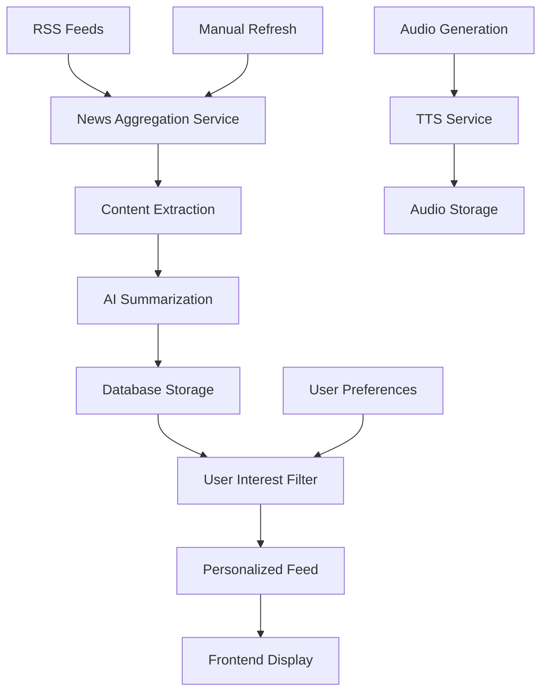
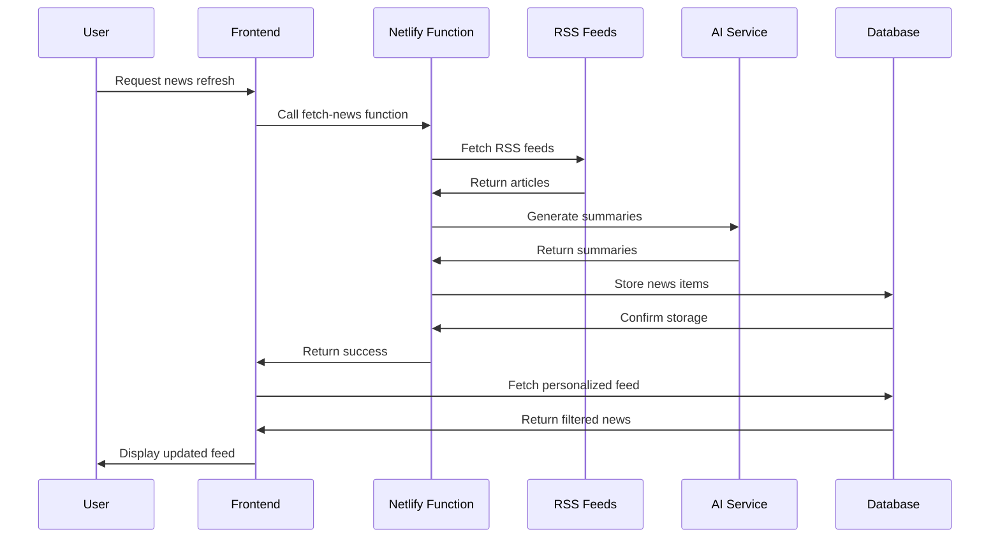

# News Feed System - How It Works

## Overview
The news feed system provides users with personalized, AI-summarized news articles based on their interests. It combines RSS feed aggregation, intelligent content curation, automatic summarization, and user preference management to deliver a tailored news consumption experience.

## User Flow

### Initial Setup Flow
1. **Interest Selection**: New users select topics of interest during onboarding
2. **Profile Creation**: Interests are saved to user profile in database
3. **Feed Generation**: System fetches relevant news based on selected interests
4. **Personalization**: Feed is customized to user preferences and reading history

### Daily News Consumption Flow
1. **Feed Access**: User navigates to news page
2. **Content Loading**: System retrieves personalized news articles
3. **Article Display**: News items shown with summaries and metadata
4. **Interaction**: User can read summaries, generate audio, or visit source
5. **Preference Updates**: User can modify interests to refine feed

### News Refresh Flow
1. **Manual Refresh**: User triggers news update via refresh button
2. **Content Fetching**: Netlify function aggregates latest articles from RSS feeds
3. **AI Processing**: New articles are automatically summarized
4. **Database Update**: Fresh content is stored with metadata
5. **Feed Update**: User's personalized feed is refreshed with new content

## Technical Implementation

### Frontend Components

#### News Store (`src/store/newsStore.ts`)
```typescript
interface NewsState {
  newsItems: NewsItem[];
  interests: UserInterest[];
  selectedInterests: string[];
  isLoading: boolean;
  error: string | null;
  fetchNewsItems: () => Promise<void>;
  fetchAvailableInterests: () => Promise<void>;
  updateUserInterests: (interests: string[]) => Promise<void>;
  generateAudioForNewsItem: (newsItemId: string) => Promise<void>;
  refreshNews: () => Promise<void>;
}
```

**Core Functions:**
- `fetchNewsItems()`: Retrieve personalized news feed
- `updateUserInterests()`: Modify user's topic preferences
- `refreshNews()`: Trigger fresh content aggregation
- `generateAudioForNewsItem()`: Create audio versions of summaries

#### News Feed Component (`src/components/news/NewsFeed.tsx`)
- Displays personalized news articles
- Infinite scroll for large feeds
- Article interaction controls
- Loading states and error handling

#### Interest Selector (`src/components/news/InterestSelector.tsx`)
- Multi-select interface for topics
- Real-time preference updates
- Visual feedback for selections
- Integration with user profile

#### News Item Component (`src/components/news/NewsItem.tsx`)
- Individual article display
- Summary presentation
- Source attribution
- Audio playback controls

### Backend Implementation

#### Database Schema

##### News Table
```sql
CREATE TABLE news (
  id UUID PRIMARY KEY DEFAULT gen_random_uuid(),
  title TEXT NOT NULL,
  source_url TEXT NOT NULL,
  category TEXT NOT NULL,
  summary TEXT NOT NULL,
  published_at TIMESTAMPTZ DEFAULT now(),
  image_url TEXT,
  audio_url TEXT
);
```

##### Interests Table
```sql
CREATE TABLE interests (
  id UUID PRIMARY KEY DEFAULT gen_random_uuid(),
  name TEXT UNIQUE NOT NULL
);

-- Default interests
INSERT INTO interests (name) VALUES
  ('technology'), ('world'), ('business'), ('science'),
  ('health'), ('entertainment'), ('sports'), ('politics'),
  ('crypto'), ('ai');
```

##### User Interests (Profile Integration)
```sql
-- interests column in profiles table
ALTER TABLE profiles ADD COLUMN interests text[] DEFAULT '{}';
```

#### News Aggregation Service (`netlify/functions/fetch-news.js`)

##### RSS Feed Sources
```javascript
const RSS_FEEDS = {
  technology: [
    'https://feeds.feedburner.com/TechCrunch',
    'https://www.theverge.com/rss/index.xml',
    'https://feeds.arstechnica.com/arstechnica/index'
  ],
  world: [
    'https://feeds.bbci.co.uk/news/world/rss.xml',
    'https://rss.cnn.com/rss/edition.rss',
    'https://feeds.reuters.com/reuters/worldNews'
  ],
  business: [
    'https://feeds.bloomberg.com/markets/news.rss',
    'https://feeds.fortune.com/fortune/headlines',
    'https://feeds.feedburner.com/entrepreneur/latest'
  ],
  science: [
    'https://feeds.nature.com/nature/rss/current',
    'https://rss.sciencedaily.com/top.xml',
    'https://feeds.feedburner.com/NewScientist'
  ],
  crypto: [
    'https://cointelegraph.com/rss',
    'https://feeds.feedburner.com/CoinDesk',
    'https://decrypt.co/feed'
  ]
};
```

##### Content Processing Pipeline
```javascript
async function processNewsFeeds() {
  for (const [category, feeds] of Object.entries(RSS_FEEDS)) {
    for (const feedUrl of feeds) {
      try {
        // Parse RSS feed
        const feed = await parser.parseURL(feedUrl);
        
        // Process each article
        for (const item of feed.items.slice(0, 5)) {
          // Extract article content
          const content = await extractArticleContent(item.link);
          
          // Generate AI summary
          const summary = await generateSummary(content);
          
          // Store in database
          await saveNewsItem({
            title: item.title,
            sourceUrl: item.link,
            category: category,
            summary: summary,
            publishedAt: item.pubDate,
            imageUrl: extractImageUrl(item)
          });
        }
      } catch (error) {
        console.error(`Error processing feed ${feedUrl}:`, error);
      }
    }
  }
}
```

##### AI Summary Generation
```javascript
async function generateSummary(content) {
  const response = await openai.chat.completions.create({
    model: 'gpt-3.5-turbo',
    messages: [
      {
        role: 'system',
        content: 'You are a news summarizer. Create concise, informative summaries of news articles in 2-3 sentences.'
      },
      {
        role: 'user',
        content: `Summarize this news article: ${content}`
      }
    ],
    max_tokens: 150,
    temperature: 0.3
  });
  
  return response.choices[0].message.content;
}
```

### Personalization Engine

#### Interest-Based Filtering (`src/lib/supabase.ts`)
```typescript
export async function getNewsItems(userId: string) {
  // Get user interests
  const { data: profile } = await supabase
    .from('profiles')
    .select('interests')
    .eq('id', userId)
    .single();
  
  const interests = profile?.interests || [];
  
  // Fetch news based on interests
  const { data, error } = await supabase
    .from('news')
    .select('*')
    .in('category', interests.length > 0 ? interests : ['general'])
    .order('published_at', { ascending: false })
    .limit(20);
  
  return { data, error };
}
```

#### Dynamic Interest Updates
```typescript
export async function saveUserInterests(userId: string, interests: string[]) {
  const { data, error } = await supabase
    .from('profiles')
    .update({ interests })
    .eq('id', userId);
  
  return { data, error };
}
```

## News Feed Architecture

### Content Flow Diagram


### Data Processing Pipeline


## Content Curation Strategy

### RSS Feed Selection Criteria
1. **Reliability**: Established news sources with consistent updates
2. **Quality**: High editorial standards and factual reporting
3. **Diversity**: Multiple perspectives and source types
4. **Freshness**: Regular content updates throughout the day
5. **Relevance**: Content aligned with user interest categories

### Content Quality Control
- Duplicate article detection and removal
- Content length validation (minimum viable content)
- Source credibility verification
- Spam and low-quality content filtering
- Broken link detection and handling

### Summary Quality Assurance
- Consistent summary length (2-3 sentences)
- Factual accuracy preservation
- Key information retention
- Neutral tone maintenance
- Readability optimization

## User Interest Management

### Available Interest Categories
```typescript
const INTEREST_CATEGORIES = [
  'technology',    // Tech news, gadgets, software
  'world',        // International news, politics
  'business',     // Markets, economy, finance
  'science',      // Research, discoveries, innovation
  'health',       // Medical news, wellness, fitness
  'entertainment', // Movies, music, celebrity news
  'sports',       // Sports news, scores, events
  'politics',     // Political news, elections, policy
  'crypto',       // Cryptocurrency, blockchain, DeFi
  'ai'           // Artificial intelligence, machine learning
];
```

### Interest Selection Interface
- Multi-select checkboxes for easy selection
- Visual indicators for selected interests
- Real-time feed preview as interests change
- Ability to select/deselect all interests
- Minimum interest requirement (at least one)

### Preference Persistence
- Interests saved to user profile in database
- Automatic sync across devices
- Immediate feed updates on preference changes
- Fallback to general news if no interests selected

## Audio Integration

### Text-to-Speech for News
```typescript
export async function generateAudioForNewsItem(newsItemId: string) {
  const newsItem = get().newsItems.find(item => item.id === newsItemId);
  if (!newsItem) return;
  
  // Generate audio using TTS service
  const audioUrl = await generateAudio(newsItem.summary, user.isPremium);
  
  // Update news item with audio URL
  set(state => ({
    newsItems: state.newsItems.map(item => 
      item.id === newsItemId 
        ? { ...item, audioUrl } 
        : item
    )
  }));
}
```

### Audio Features
- Premium-only audio generation
- High-quality voice synthesis
- Playback controls in news items
- Audio caching for repeated access
- Background audio playback support

## Performance Optimizations

### Caching Strategy
- News items cached in Zustand store
- Intelligent cache invalidation
- Background refresh without UI blocking
- Optimistic updates for user interactions

### Loading Optimizations
- Lazy loading for large news feeds
- Image lazy loading with placeholders
- Progressive content loading
- Skeleton screens during load states

### Data Efficiency
- Pagination for large news feeds
- Selective field loading from database
- Compressed image delivery
- Minimal API payload sizes

## Error Handling

### Network Error Recovery
```typescript
// Retry mechanism for failed requests
const retryFetch = async (url: string, retries = 3) => {
  for (let i = 0; i < retries; i++) {
    try {
      return await fetch(url);
    } catch (error) {
      if (i === retries - 1) throw error;
      await new Promise(resolve => setTimeout(resolve, 1000 * (i + 1)));
    }
  }
};
```

### Graceful Degradation
- Fallback to cached content when refresh fails
- Default interests when user preferences unavailable
- Generic error messages for user-friendly experience
- Partial content loading when some sources fail

### User Feedback
- Loading indicators during refresh operations
- Error messages with retry options
- Success notifications for preference updates
- Progress indicators for long operations

## Security and Privacy

### Data Protection
- User interests stored securely in database
- No tracking of reading behavior
- GDPR-compliant data handling
- Secure API endpoints with authentication

### Content Safety
- Source verification for RSS feeds
- Content moderation for inappropriate material
- Spam detection and filtering
- Malicious link protection

## Integration Points

### Authentication Integration
- User authentication required for personalization
- Interest preferences tied to user accounts
- Premium features gated by subscription status
- Secure API access with JWT tokens

### Summary System Integration
- Shared AI summarization engine
- Consistent summary quality across features
- Unified user preferences for summary style
- Cross-feature content caching

## Benefits and Limitations

### Benefits
- **Personalized Content**: Tailored to user interests
- **Time Efficient**: Pre-summarized articles save reading time
- **Diverse Sources**: Multiple RSS feeds for comprehensive coverage
- **Audio Support**: Hands-free news consumption
- **Real-time Updates**: Fresh content throughout the day

### Limitations
- **Source Dependency**: Limited by RSS feed availability
- **Language Support**: Primarily English content
- **Update Frequency**: Manual refresh required for latest content
- **Content Depth**: Summaries may miss nuanced details
- **Regional Coverage**: May lack local news sources

## Future Enhancements

### Planned Features
- [ ] Automatic news refresh (scheduled updates)
- [ ] Push notifications for breaking news
- [ ] Social sharing capabilities
- [ ] Bookmark and save articles
- [ ] Advanced filtering and search
- [ ] Trending topics detection
- [ ] Multi-language support
- [ ] Local news integration
- [ ] User-submitted RSS feeds
- [ ] AI-powered content recommendations
