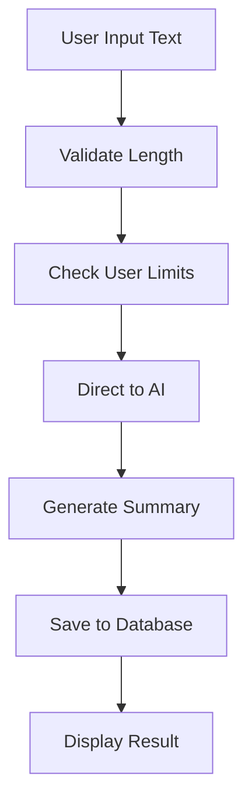
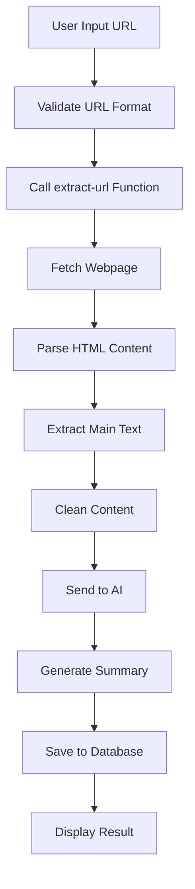
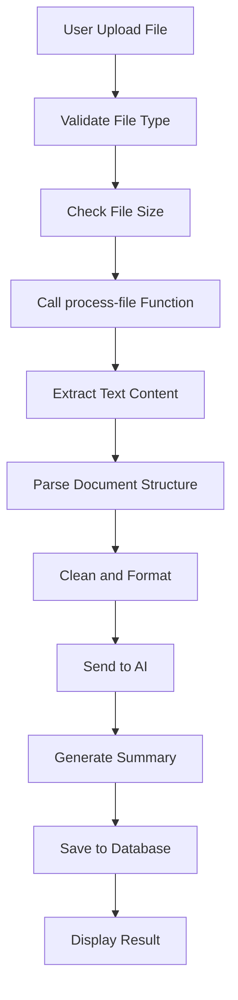

# Summary Creation System - How It Works

## Overview
The summary creation system is the core feature of TLDRit, enabling users to generate AI-powered summaries from three input types: direct text, URLs, and file uploads. The system supports customizable summary levels, ELI5 explanations, and integrates with premium AI models for enhanced processing.

## User Flow

### Text Input Summary Flow
1. **Input**: User pastes or types text into the textarea
2. **Validation**: System checks text length and user limits
3. **Processing**: Text is sent directly to AI for summarization
4. **Generation**: AI creates summary based on user preferences
5. **Storage**: Summary is saved to database with metadata
6. **Display**: Result is shown in overlay with options to regenerate

### URL Input Summary Flow
1. **Input**: User enters a URL in the input field
2. **Validation**: System validates URL format and accessibility
3. **Content Extraction**: Netlify function extracts text from webpage
4. **Processing**: Extracted content is processed and cleaned
5. **Summarization**: AI generates summary from extracted text
6. **Storage**: Summary and original URL are saved to database
7. **Display**: Result is presented with regeneration options

### File Upload Summary Flow
1. **Input**: User uploads PDF, DOCX, or TXT file
2. **Validation**: System checks file type, size, and user limits
3. **File Processing**: Netlify function extracts text from file
4. **Content Parsing**: Text is cleaned and formatted
5. **Summarization**: AI processes the extracted content
6. **Storage**: Summary and file metadata are saved
7. **Display**: Result is shown with customization options

## Technical Implementation

### Frontend Components

#### SummarizeForm Component (`src/components/summarize/SummarizeForm.tsx`)
```typescript
interface SummarizeFormState {
  inputType: 'text' | 'url' | 'file';
  content: string;
  file: File | null;
  isEli5: boolean;
  summaryLevel: number;
  error: string;
  showOverlay: boolean;
}
```

**Key Features:**
- Multi-input type selector (text/URL/file)
- Real-time validation and error handling
- Drag-and-drop file upload support
- Summary customization controls
- Responsive overlay for results

#### Summary Store (`src/store/summaryStore.ts`)
```typescript
interface SummaryState {
  summaries: Summary[];
  currentSummary: Summary | null;
  isLoading: boolean;
  error: string | null;
  createSummary: (request: SummaryRequest) => Promise<void>;
  fetchSummaries: () => Promise<void>;
  generateAudioForSummary: (summaryId: string) => Promise<void>;
}
```

**Core Functions:**
- `createSummary()`: Main processing pipeline
- `fetchSummaries()`: Retrieve user's summary history
- `generateAudioForSummary()`: Create audio versions

### Content Processing Pipeline

#### Text Processing Flow


#### URL Processing Flow


#### File Processing Flow


### AI Integration (`src/lib/ai.ts`)

#### Summary Generation Function
```typescript
export async function summarizeContent(content: string, options: SummarizeOptions) {
  const { isPremium, isEli5, summaryLevel, eli5Level } = options;
  
  // Determine API based on user tier and content length
  const useOpenRouter = isPremium && content.length > 1000;
  const apiUrl = useOpenRouter ? OPENROUTER_API_URL : OPENAI_API_URL;
  
  // Select model based on subscription
  const model = useOpenRouter 
    ? 'anthropic/claude-3-opus'
    : 'gpt-3.5-turbo';
  
  // Configure summary parameters
  const summaryLength = getSummaryLengthFromLevel(summaryLevel);
  const systemMessage = createSystemMessage(isEli5, eli5Level);
  const userMessage = createUserMessage(content, isEli5, summaryLength, eli5Level);
  
  // Generate summary
  const response = await axios.post(apiUrl, {
    model,
    messages: [
      { role: 'system', content: systemMessage },
      { role: 'user', content: userMessage }
    ],
    temperature: 0.7,
    max_tokens: summaryLength * 4,
  }, { headers });

  return { summary: response.data.choices[0].message.content };
}
```

#### Summary Level Configuration
```typescript
function getSummaryLengthFromLevel(level: number): number {
  const wordCounts = {
    1: 50,    // Very Short - Title + 1 line
    2: 100,   // Short - Key points only
    3: 200,   // Medium - Balanced overview
    4: 350,   // Detailed - Comprehensive summary
  };
  return wordCounts[level] || 200;
}
```

#### ELI5 Implementation
```typescript
function getEliPrompt(age: number) {
  if (age <= 5) {
    return 'Explain in very simple terms, as if to a 5-year-old.';
  } else if (age <= 10) {
    return 'Explain in moderately simple terms, as if to a 10-year-old.';
  } else {
    return 'Explain in clear, but more advanced terms, as if to a 15-year-old.';
  }
}
```

### Content Extraction Services

#### URL Content Extraction (`netlify/functions/extract-url.js`)
```javascript
// Main content extraction logic
const dom = new JSDOM(html);
const document = dom.window.document;

// Priority-based content selection
const contentSelectors = [
  'article',           // Semantic article content
  'main',             // Main content area
  '.content',         // Common content class
  '.post-content',    // Blog post content
  '.entry-content',   // WordPress content
  '.article-content', // Article-specific content
  '.story-body',      // News story content
  '#content'          // Content ID
];

// Extract and clean content
content = content
  .replace(/\s*\n\s*\n\s*/g, '\n\n') // Preserve paragraphs
  .replace(/\s*\n\s*/g, ' ')         // Convert line breaks
  .replace(/\s+/g, ' ')              // Normalize spaces
  .trim();
```

#### File Content Processing (`netlify/functions/process-file.js`)
```javascript
// Multi-format file processing
if (fileType === 'application/pdf') {
  // PDF processing with pdf-parse
  const pdfData = await pdfParse(buffer);
  content = pdfData.text;
} else if (fileType.includes('word')) {
  // DOCX processing with mammoth
  const result = await mammoth.extractRawText({ buffer });
  content = result.value;
} else if (fileType === 'text/plain') {
  // Plain text processing
  content = buffer.toString('utf-8');
}
```

### Database Integration

#### Summary Storage Schema
```sql
CREATE TABLE summaries (
  id UUID PRIMARY KEY DEFAULT gen_random_uuid(),
  user_id UUID REFERENCES profiles(id) NOT NULL,
  title TEXT NOT NULL,
  original_content TEXT NOT NULL,
  summary TEXT NOT NULL,
  is_eli5 BOOLEAN DEFAULT false,
  summary_level INTEGER DEFAULT 3,
  audio_url TEXT,
  created_at TIMESTAMPTZ DEFAULT now()
);
```

#### Summary Save Function (`src/lib/supabase.ts`)
```typescript
export async function saveSummary(summary: Omit<Summary, 'id' | 'createdAt'>) {
  const { data, error } = await supabase
    .from('summaries')
    .insert({
      user_id: summary.userId,
      title: summary.title,
      original_content: summary.originalContent,
      summary: summary.summary,
      is_eli5: summary.isEli5,
      summary_level: summary.summaryLevel,
      audio_url: summary.audioUrl,
    })
    .select();
  
  return { data, error };
}
```

## Summary Customization Features

### Summary Levels
1. **Level 1 (Very Short)**: ~50 words - Title + key point
2. **Level 2 (Short)**: ~100 words - Main points only
3. **Level 3 (Medium)**: ~200 words - Balanced overview
4. **Level 4 (Detailed)**: ~350 words - Comprehensive summary

### ELI5 Mode
- **Age 5**: Very simple language, basic concepts
- **Age 10**: Moderate complexity, some technical terms
- **Age 15**: Advanced explanations, full context

### Smart Regeneration
- Checks existing summaries before creating new ones
- Instant loading of previously generated summaries
- Highlights regenerate button when settings change
- Preserves user preferences across sessions

## User Limits and Premium Features

### Free Tier Limitations
```typescript
// Content length limits
const FREE_TEXT_LIMIT = 5000; // characters
const FREE_FILE_LIMIT = 5 * 1024 * 1024; // 5MB

// Daily usage limits
const FREE_SUMMARY_LIMIT = 5; // per day

// Model restrictions
const FREE_MODEL = 'gpt-3.5-turbo';
```

### Premium Tier Benefits
```typescript
// Enhanced limits
const PREMIUM_TEXT_LIMIT = 50000; // characters
const PREMIUM_FILE_LIMIT = 20 * 1024 * 1024; // 20MB

// Unlimited usage
const PREMIUM_SUMMARY_LIMIT = Infinity;

// Advanced models
const PREMIUM_MODELS = [
  'gpt-4',
  'anthropic/claude-3-opus',
  'anthropic/claude-3-sonnet'
];
```

## Error Handling and Validation

### Input Validation
```typescript
// Text validation
if (inputType === 'text' && !content.trim()) {
  setError('Please enter some text to summarize');
  return;
}

// URL validation
if (inputType === 'url' && !isValidUrl(content)) {
  setError('Please enter a valid URL');
  return;
}

// File validation
if (inputType === 'file' && !file) {
  setError('Please upload a file to summarize');
  return;
}

// Premium limits
if (!user?.isPremium && wordCount > 500) {
  setError('Free accounts are limited to 500 words. Upgrade to summarize longer content.');
  return;
}
```

### Error Recovery
- Network error retry mechanisms
- Graceful degradation for API failures
- User-friendly error messages
- Automatic fallback to alternative models

## Performance Optimizations

### Caching Strategy
- Summary history cached in Zustand store
- Duplicate summary detection and reuse
- Optimistic UI updates during processing
- Background prefetching of user data

### Processing Efficiency
- Parallel processing for multiple operations
- Content chunking for large documents
- Streaming responses for real-time feedback
- Intelligent model selection based on content

### User Experience
- Real-time character counting
- Progress indicators during processing
- Instant feedback for validation errors
- Smooth transitions and animations

## Integration Points

### Authentication Integration
- User authentication required for saving
- Premium status affects available features
- Usage tracking per user account
- Personalized summary history

### Audio Generation Integration
- Seamless TTS generation from summaries
- Premium-only audio features
- Audio URL storage and retrieval
- Playback controls in summary overlay

### News Feed Integration
- Shared summarization engine
- Consistent summary quality
- Unified user preferences
- Cross-feature data sharing

## Benefits and Limitations

### Benefits
- **Multi-format Support**: Text, URL, and file inputs
- **Customizable Output**: Multiple summary levels and styles
- **Smart Caching**: Avoids duplicate processing
- **Premium Features**: Advanced AI models for better quality
- **User-friendly**: Intuitive interface with real-time feedback

### Limitations
- **File Format Support**: Limited to PDF, DOCX, TXT
- **Content Length**: Processing limits based on subscription
- **Language Support**: Primarily English content
- **Processing Time**: Dependent on external AI services
- **Internet Dependency**: Requires connection for AI processing

## Future Enhancements

### Planned Features
- [ ] Batch processing for multiple files
- [ ] Custom summary templates
- [ ] Collaborative summary editing
- [ ] Summary comparison tools
- [ ] Advanced formatting options
- [ ] Multi-language support
- [ ] Offline processing capabilities
- [ ] Integration with external tools
